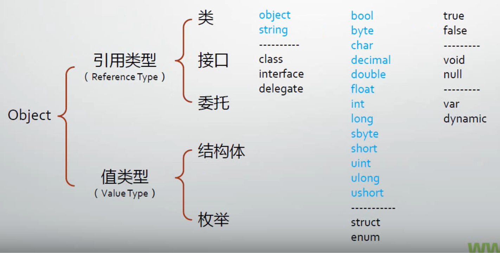

# 007 类型、变量与对象详解-下

## C#语言的类型系统

- C#的五大数据类型
  - 类（Classes）：如 Windows、Form、Console、String
  - 结构体（Structures）：如 Int32、Int64、Single、Double
  - 枚举（Enumerations）：如 HorizontalAlignment、Visibility
  - 接口（Interfaces）
  - 委托（Delegates）
- C#类型的派生谱系

## 变量、对象与内存

- 什么是变量：以变量名所对应的内存地址为起点、以其数据类型所要求的存储空间为长度的一块内存区域
  - 表面上来看，变量的用途是存储数据
  - 实际上，变量表示了存储位置，并且每个变量都有一个类型，以决定什么样的值能够存入变量
  - 变量一共有 7 种
    - 静态变量，实例变量（成员变量，字段），数组元素，值参数，引用参数，输出形参，局部变量
  - 狭义的变量指局部变量，因为其他种类的变量都有自己的约定名称
    - 简单地讲，局部变量就是方法体（函数体）里声明的变量
  - 变量的声明
    - 有效的修饰符组合 opt 类型 变量名 初始化器 opt
- 值类型的变量
  - 以 byte/sbyte/short/ushort 为例
  - 值类型没有实例，所谓的“实例”与变量合而为一
- 引用类型的变量与实例
  - 引用类型变量与实例的关系：引用类型变量里存储的数据是对象的内存地址
- 局部变量是在 stack 上分配内存
- 变量的默认值
- 常量（值不可改变的变量）
- 装箱与拆箱（Boxing & Unboxing）

> 堆实例 栈值
