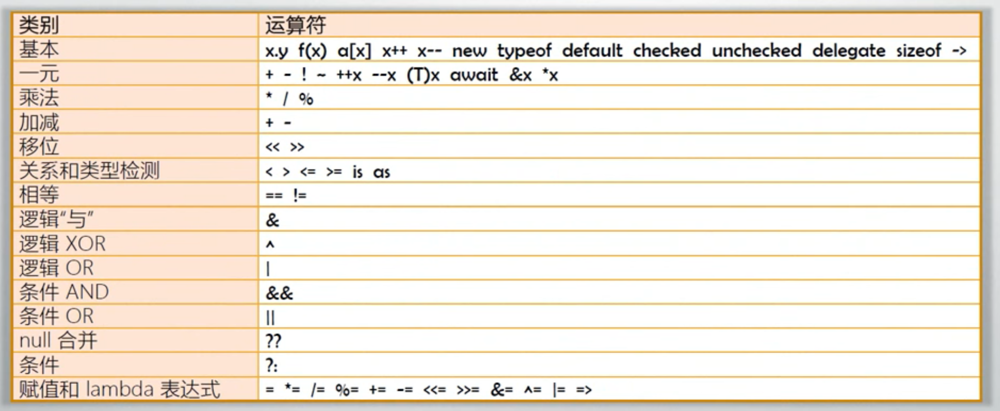

# 010 操作符详解（上）

- 操作符概览
- 操作符的本质
- 操作符的优先级
- 同级操作符的运算顺序
- 各类操作符的示例

## 操作符概览

- 操作符（Operator）也译为“运算符”
- 操作符是用来操作数据的，被操作符操作的数据称为操作数（Operand）

## 操作符的本质

- 操作符的本质是函数（即算法）的“简记法”
  - 假如没有发明“+”，只有 Add 函数，算式`3+4+5`将可以写成`Add(Add(3,4),5)`
- 操作符不能脱离与它关联的数据类型
  - 可以说操作符就是与固定数据类型相关联的一套基本算法的简记法
  - 示例：为自定义数据类型创建操作符

## 优先级与运算顺序

- 操作符的优先级
  - 可以使用圆括号提高被括起来表达式的优先级
  - 圆括号可以嵌套
  - 不像数学里有方括号和花括号，在 C#语言里“[]”与“{}”有专门的用途
- 同优先级操作符的运算顺序
  - 除了带有赋值功能的操作符，同优先级操作符都是由左向右进行运算
  - 带有赋值功能的操作符的运算顺序是由右向左
  - 与数学运算不同，计算机语言的同优先级运算没有“结合率”
    - `3+4+4`只能理解为`Add(Add(3,4),5)`，不能理解为`Add(3, Add(4,5))`

## 各类操作符的示例

- typeof: 获取类型结构
- default: 获取类型默认值 （结构、引用、枚举等）
