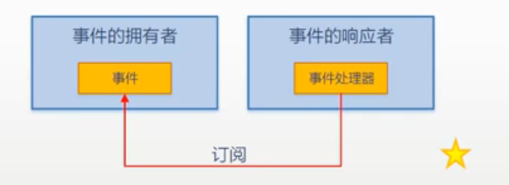

# 020-022 事件详解

- 初步了解事件
- 事件的应用
- 深入理解事件
- 事件的声明
- 问题辨析

## 初步了解事件

- 定义: 单词 Event, 译为"事件"
  - 词典中解释: a thing that happens, especially something important
  - 通顺解释: 能够发生的什么事情
- 角色: 使对象或类具备*通知能力*的成员
  - 事件(event)是一种使对象或类能够提供通知的成员
  - An event is a member that enables an object or class to provide notifications
  - "对象 O 拥有一个事件 E"想表达的思想是: 当事件 E 发生的时候, O 有能力通知别的对象
- 使用: 用于对象或类间的动作协调与信息的传递(消息推送)
- 原理: 事件模型(event model)中的两个"5"
  - "发生->响应"中的 5 个部分--闹钟响了你吃饭,孩子饿了你做饭......这里隐含"订阅"关系
  - "发生->响应"中的 5 个动作-- 1 我有一个事件 -> 2 一个人或一群人关心我的这个事件 -> 3 我的这个事件发生了 -> 4 关心这个事件的人会被依次通知到 -> 5 被通知到的人根据拿到的事件信息(又称"事件数据"、"事件参数"、"通知")对事件进行响应(又称"处理事件")
- 提示
  - 事件多用于桌面、手机等开发的客户端编程, 因为这些程序经常是用户通过事件来驱动的
  - 各种编程语言对这个机制的实现方法不尽相同
  - Java 语言里没有事件这种成员, 也没有委托这种数据类型. Java 的"事件"是使用接口来实现的
  - MVC、MVP、MVVP 等模式， 是事件模式更高级、更有效的“玩法”
  - 日常开发的时候， 使用已有事件的机会比较多， 自己声明事件的机会比较少， 所以先学使用

## 事件的应用

- 实例演示
  - 派生（继承）与扩展(extends)
- 事件模型的 5 个组成部分
  - 1.事件的拥有者(event source, 对象)
  - 2.事件成员(event, 成员)
  - 3.事件的响应者(event subscriber, 对象)
  - 4.事件处理器(event handler, 成员) -- 本质上是一个回调方法
  - 5.事件订阅 -- 把事件处理器与事件关联在一起, 本质上是一种以委托类型为基础的"约定"
- 注意
  - 事件处理器是方法成员
  - 挂接事件处理器的时候,可以使用委托实例, 也可以直接使用方法名, 这是个"语法糖"
  - 事件处理器对事件的订阅不是随意的, 匹配与否由声明事件时所使用的委托类型来检测
  - 事件可以同步调用也可以异步调用

- 3个例子

## 事件的声明

- 事件的声明
  - 完整声明
  - 简略声明(字段式声明, field-like)
- 有了委托字段/属性, 为什么还需要事件?
  - 为了程序的逻辑更加"有道理"、更加安全, *谨防"借刀杀人"*
- 所以*事件的本质*是委托字段的一个包装器
  - 这个包装器对委托字段的访问起*限制作用*, 相当于一个"蒙版"
  - 封装(encapsulation)的一个重要功能就是隐藏
  - 事件*对外界*隐藏了委托实例的大部分功能, *仅暴露添加/移除事件处理器的功能*
  - 添加/移除事件处理器的时候可以直接使用方法名, 这是委托实例所不具备的功能
- 用于声明事件的委托类型的命名约定
  - 用于声明Foo事件的委托, 一般命名为FooEventHandler(除非是一个非常通用的事件约束)
  - FooEventHandler委托的参数一般有两个(由Win32 API演化而来, 历史悠久)
    - 第一个是object类型, 名字为sender, 实际上就是事件的拥有者, 事件的source
    - 第二个是EventArgs类的派生类, 类名一般为FooEventArgs, 参数名为e. 也就是前面讲的事件参数
    - 虽然没有官方的说法, 但我们可以把委托的参数列表看作是事件发生后发送给事件响应者的"*事件消息*"
  - 触发Foo事件的方法一般命名为OnFoo, 即"因何引发"、"*事出有因*"
    - 访问级别为protected, 不能为public, 不然又成了可以"借刀杀人"了
- 事件的命名约定
  - 带有时态的动词或动词短语
  - 事件拥有者"正在做"什么事情, 用进行时; 事件拥有者"做完了"什么事情, 用完成时
  
> 委托是事件的底层基础, 事件是委托的上层建筑

## 事件与委托的关系

- 事件真的是"以特殊方式声明的委托字段/实例"吗?
  - *不是!* 只是声明的时候"看起来像"(对比委托字段与事件的简化声明, field-like)
  - 事件声明的时候使用了委托类型,简化声明造成事件看上去像一个委托的字段(实例), 而event关键字则更像是一个修饰符--这就是*错觉的又一来源*
  - 重申: 事件的本质是加装在委托字段上的一个"蒙版"(mask), 是个起掩蔽作用的包装器. 这个用于阻挡非法操作的"蒙版"绝不是委托字段本身
- 为什么要使用委托类型来声明事件?
  - 站在source的角度来看, 是为了表明source能对外传递哪些消息
  - 站在subscriber的角度来看, 它是一种约定, 是为了约束能够使用什么样签名的方法来处理(响应)事件
  - 委托类型的实例将用于存储(引用)事件处理器
- 对比事件与属性
  - 属性不是字段--*很多时候*属性是字段的包装器, 这个包装器用来保护字段不被滥用
  - 事件不是委托字段--它是委托字段的包装器, 这个包装器用来保护委托字段不被滥用
  - 包装器永远都不可能是被包装的东西
  