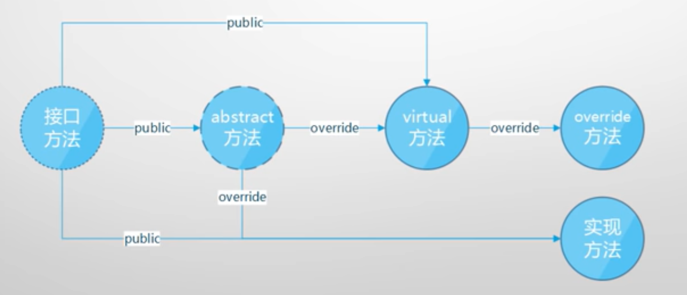
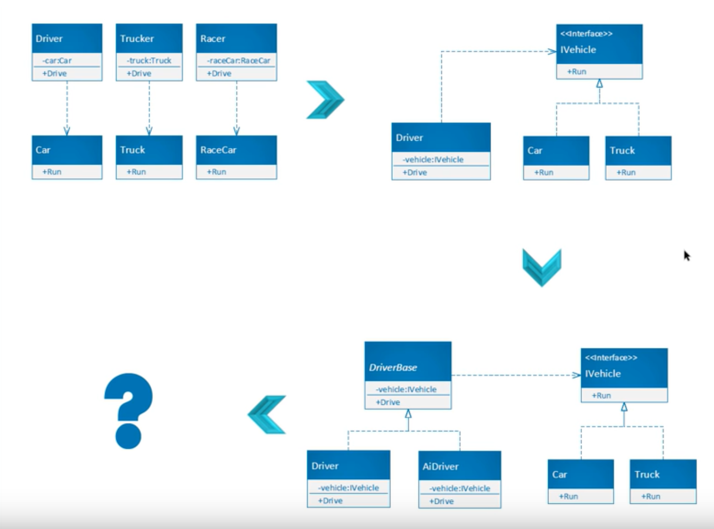

# 027-029 接口, 抽象类, SOLID, 单元测试, 反射

- 027 抽象类与开闭原则
- 028 接口, 依赖反转, 单元测试
- 029 接口隔离, 反射, 特性, 依赖注入

## 什么是接口和抽象类

- 接口和抽象类都是"软件工程产物"
- 具体类->抽象类->接口: 越来越抽象, 内部实现的东西越来越少
- 抽象类是未完成实现逻辑的类(可以有字段和非 public 成员, 它们代表了"具体逻辑")
- 抽象类是为复用而生: 专门作为基类来使用, 也具有解耦功能
- 封装确定的, 开放不确定的, 推迟到合适的子类中去实现
- 接口是完全来实现逻辑的"类" ("纯虚类"; 只有函数成员; 成员全部 public)
- 接口为解耦而生: "高内聚, 低耦合", 方便单元测试
- 接口是一个"协约", 早已为工业生产所熟知(有分工必有协作, 有协作必有协约)
- 它们都不能被实例化, 只能用来声明变量、引用具体类(concrete class)的实例

## 接口与单元测试

- 接口的产生: 自底向上(重构), 自顶向下(设计)
- C#中接口的实现(隐式, 显式, 多接口)
- 语言对面向对象的内建支持: 依赖反转, 接口隔离, 开/闭原则......
  - 解耦在代码中的表现就是依赖反转(倒置)
  - 单元测试就是依赖反转在开发中的直接应用和直接受益者
  - 依赖反转原则
  - 当类实现一个接口的时候, 类与接口之间的关系也是"紧耦合"

- 同一 solution 下新建 net core xUnit 单元测试项目
  - 单元测试实例测试
  - 使用 NuGet 引入 Moq(读作 mock)
    - 创建实现接口方法的实例, 越过创建类

## 反射与依赖注入

> 三个接口实例 接口隔离 显式接口 IspExample 1 2
> 反射实例一 在 IspExample 基础上
> 依赖注入: 封装好的反射 nuGet Mircrosoft.Extensions.Dependency injection

- 反射
  - 依赖注入
  - 更松的耦合(插件式编程)
- 反射: 以不变应万变(更松的耦合)
- 反射与接口的结合
- 反射与特性的结合
- 依赖注入: 此 DI 非彼 DI, 但没有彼 DI 就没有此 DI
