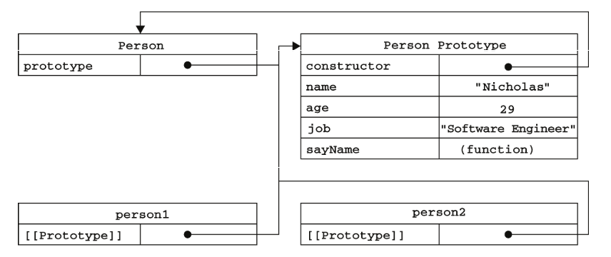
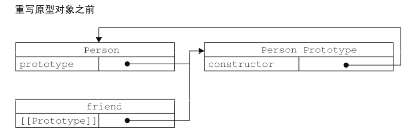
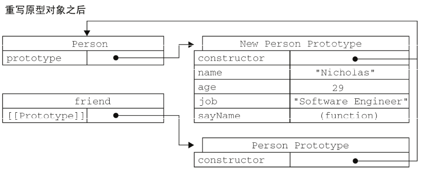
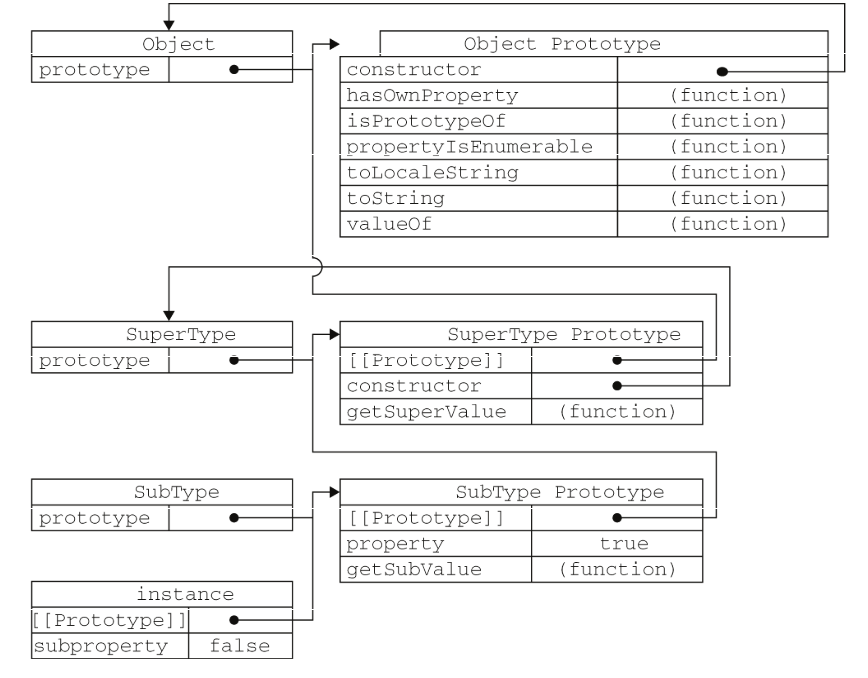
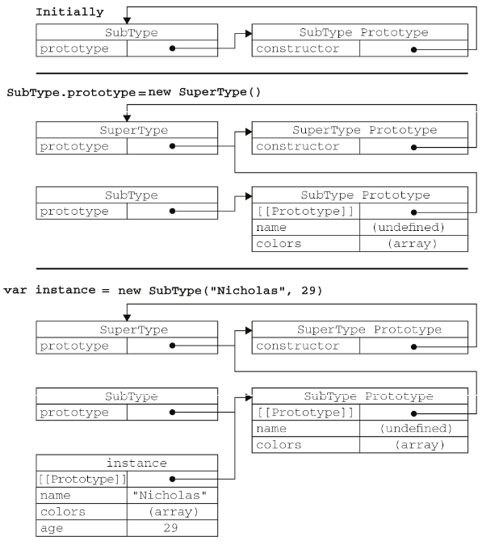

# 面向对象的程序设计

- 理解对象属性
- 理解并创建对象
- 理解继承

面向对象（Object-Oriented，OO）的语言有一个标志,都有类的概念,通过类可以创建任意多个具有相同属性和方法的对象。ECMAScript中没有类的概念，因此它的对象也与基于类的语言中的对象有所不同

对象定义：无序属性的集合，其属性可以包含基本值、对象或者函数。（相当于说对象是一组没有特定顺序的值）

> 每个对象都是基于一个引用类型创建的,这个引用类型可以是原生类型，也可以是开发人员定义的类型。

## 理解对象

- 创建自定义对象的最简单方式就是创建一个 Object 的实例，然后再为它添加属性和方法

 ```javascript
 var person = new Object();
 person.name = "Nicholas";
 person.sayName = function(){
   alert(this.name);
 };
 ```

- 对象字面量成为创建这种对象的首选模式:

   ```javascript
   var person = {
     name: "Nicholas",
     sayName: function(){
       lert(this.name);
      }
   }
   ```

### 属性类型

ECMAScript中有两种属性：数据属性和访问器属性

#### 数据属性

数据属性包含一个数据值的位置。在这个位置可以读取和写入值。有 4 个描述其行为的特性:

- [[Configurable]]：表示能否通过 delete 删除属性从而重新定义属性，能否修改属性的特性，或者能否把属性修改为访问器属性
- [[Enumerable]]：表示能否通过 for-in 循环返回属性
- [[Writable]]：表示能否修改属性的值
- [[Value]]：包含这个属性的数据值。读取属性值的时候，从这个位置读；写入属性值的时候把新值保存在这个位置。这个特性的默认值为 undefined
> 像前面例子中那样直接在对象上定义的属性，它们的[[Configurable]]、[[Enumerable]]和[[Writable]]特性都被设置为 true,而[[Value]]特性被设置为指定的值

Object.defineProperty()方法:要修改属性默认的特性，必须使用此方法

- 接收三个参数：属性所在的对象、属性的名字和一个描述符对象。描述符（descriptor）对象的属性必须是：configurable、enumerable、writable 和 value。设置其中的一或多个值，可以修改对应的特性值

 ```javascript
 var person = {};
 Object.defineProperty(person, "name", {
   writable: false,
   value: "Nicholas"
 });
 ```

- 一旦把属性定义为不可配置的，即configurable: false,就不能再把它变回可配置了

> 调用 Object.defineProperty()方法时，如果不指定，configurable、enumerable 和writable 特性的默认值都是 false。

#### 访问器属性

访问器属性不包含数据值；它们包含一对 getter和 setter函数（不是必需的）,在读取访问器属性时，会调用 getter函数，这个函数负责返回有效的值；在写入访问器属性时，会调用setter函数并传入新值，这个函数负责决定如何处理数据.访问器属性有如下 4个特性:

- [[Configurable]]：表示能否通过 delete 删除属性从而重新定义属性，能否修改属性的特性，或者能否把属性修改为数据属性.对于直接在对象上定义的属性，这个特性的默认值为 true。
- [[Enumerable]]：表示能否通过 for-in 循环返回属性。对于直接在对象上定义的属性，这个特性的默认值为 true。
- [[Get]]：在读取属性时调用的函数。默认值为 undefined。
- [[Set]]：在写入属性时调用的函数。默认值为 undefined。

访问器属性不能直接定义，必须使用 Object.defineProperty()来定义

 ```javascript
 var book = {
   _year: 2004,
   edition: 1
 }
 Object.defineProperty(book, "year", {
   get: function(){
     return this._year;
   },
   set: function(newValue){
     if (newValue > 2004) {
       this._year = newValue;
       this.edition += newValue - 2004;
     }
   }
 });

 book.year = 2005;
 alert(book.edition); //2

 // 这是使用访问器属性的常见方式，即设置一个属性的值会导致其他属性发生变化
 ```

- 只指定 getter意味着属性是不能写，尝试写入属性会被忽略。只指定 setter 函数的属性也不能读，否则在非严格模式下会返回 undefined。严格模式抛出错误

> 不讨论久方法

### 定义多个属性

- 利用Object.defineProperties()方法通过描述符一次定义多个属性。接收两个对象参数：第一个对象是要添加和修改其属性的对象，第二个对象的属性与第一个对象中要添加或修改的属性一一对应。

 ```javascript
 var book = {};
 Object.defineProperties(book, {
   _year: {
     value: 2004
   },
   edition: {
     value: 1
   },
   year: {
     get: function(){
     return this._year;
    },
    set: function(newValue){
      if (newValue > 2004) {
        this._year = newValue;
        this.edition += newValue - 2004;
      }
    }
   }
 });
 // 以上代码在 book 对象上定义了两个数据属性（_year 和 edition）和一个访问器属性（year）
 ```

### 读取属性的特性

- 使用 ECMAScript 5的 Object.getOwnPropertyDescriptor()方法，可以取得给定属性的描述符
- 接收两个参数：属性所在的对象和要读取其描述符的属性名称
- 返回值是一个对象，如果是访问器属性，这个对象的属性有 configurable、enumerable、get 和 set；如果是数据属性，这个对象的属性有 configurable、enumerable、writable 和 value。
- 可以针对任何对象——包括 DOM和BOM对象使用
  
## 创建对象

Object 构造函数或对象字面量都可以用来创建单个对象,缺点：使用同一个接口创建很多对象，会产生大量的重复代码。

### 工厂模式

软件工程领域一种广为人知的设计模式，这种模式抽象了创建具体对象的过程。
在 ECMAScript中无法创建类，开发人员发明了一种函数，用函数来封装以特定接口创建对象的细节。例：

 ```javascript
 function createPerson(name, age, job){
   var o = new Object();
   o.name = name;
   o.age = age;
   o.job = job;
   o.sayName = function(){
     alert(this.name);
   };
   return o;
 }

 var person1 = createPerson("Nicholas", 29, "Software Engineer");
 var person2 = createPerson("Greg", 27, "Doctor");
 ```

- 工厂模式虽然解决了创建多个相似对象的问题，但却没有解决对象识别的问题（即怎样知道一个对象的类型）

### 构造函数模式

ECMAScript中的构造函数可用来创建特定类型的对象。像 Object 和 Array 这样的原生构造函数，在运行时会自动出现在执行环境中。此外，也可以创建自定义的构造函数，从而定义自定义对象类型的属性和方法。将工厂模式例子重写如下：

 ```javascript
 function Person(name, age, job){
   this.name = name;
   this.age = age;
   this.job = job;
   this.sayName = function(){
     alert(this.name);
   };
 }

 var person1 = new Person("Nicholas", 29, "Software Engineer");
 var person2 = new Person("Greg", 27, "Doctor");
 // person1 和 person2 分别保存着 Person 的一个不同的实例，两个对象都有一个 constructor（构造函数）属性，该属性指向 Person
 alert(person1.constructor == Person); //true
 alert(person2.constructor == Person); //true

 // 例子中创建的所有对象既是 Object 的实例，同时也是 Person的实例
 alert(person1 instanceof Object); //true
 alert(person1 instanceof Person); //true
 ```

与之前例子区别：

- 没有显式地创建对象
- 直接将属性和方法赋给了 this 对象
- 没有 return 语句 

> 一般，构造函数始终都应该以一个大写字母开头，而非构造函数则应该以一个小写字母开头

- 要创建 Person 的新实例，必须使用 new 操作符。这种方式调用构造函数经历步骤：
  - 创建一个新对象；
  - 将构造函数的作用域赋给新对象（因此 this 就指向了这个新对象）
  - 执行构造函数中的代码（为这个新对象添加属性）；
  - 返回新对象。

#### 将构造函数当作函数

- 任何函数，通过 new 操作符来调用，就可以作为构造函数
- 任何函数，不通过 new 操作符来调用，跟普通函数一样

 ```javascript
 // 当作构造函数使用
 var person = new Person("Nicholas", 29, "Software Engineer");
 person.sayName(); //"Nicholas"

 // 作为普通函数调用
 Person("Greg", 27, "Doctor"); // 添加到 window
 window.sayName(); //"Greg"

 // 在另一个对象的作用域中调用
 var o = new Object();
 Person.call(o, "Kristen", 25, "Nurse");
 o.sayName(); //"Kristen"
 ```

#### 构造函数的问题

缺点：

- 每个方法都要在每个实例上重新创建一遍 

   ```javascript
   alert(person1.sayName == person2.sayName); //false
   ```

- 通过把函数定义转移到构造函数外部来解决这个问题。

新问题：

- 在全局作用域中定义的函数实际上只能被某个对象调用，这让全局作用域有点名不副实
- 如果对象需要定义很多方法，要定义很多个全局函数，这个自定义的引用类型就没有封装性

### 原型模式

> 创建的每个函数都有一个 prototype（原型）属性，这个属性是一个指针，指向一个对象,这个对象的用途是包含可以由特定类型的所有实例共享的属性和方法。即prototype 就是通过调用构造函数而创建的那个对象实例的原型对象。使用原型对象可以让所有对象实例共享它所包含的属性和方法。不必在构造函数中定义对象实例的信息

 ```javascript
 function Person(){
 }

 Person.prototype.name = "Nicholas";
 Person.prototype.age = 29;
 Person.prototype.job = "Software Engineer";
 Person.prototype.sayName = function(){
   alert(this.name);
 };

 var person1 = new Person();
 person1.sayName(); //"Nicholas"

 var person2 = new Person();
 person2.sayName(); //"Nicholas"
 alert(person1.sayName == person2.sayName); //true
 ```

#### 理解原型对象

- 只要创建了一个新函数，就会根据一组特定的规则为该函数创建一个 prototype属性，指向函数的原型对象。
- 默认，所有原型对象都会自动获得一个 constructor（构造函数）属性，这个属性包含一个指向 prototype 属性所在函数的指针
- 指针连接存在于实例与构造函数的原型对象之间

各个对象之间的关系图：



- isPrototypeOf()方法

 ```javascript
 alert(Person.prototype.isPrototypeOf(person1)); //true
 // person1有一个指向 Person.prototype 的指针，因此返回了 true
 ```

- Object.getPrototypeOf()：返回[[Prototype]]的值

 ```javascript
 alert(Object.getPrototypeOf(person1) == Person.prototype); //true
 alert(Object.getPrototypeOf(person1).name); //"Nicholas"
 ```

- 当为对象实例添加一个属性时，这个属性就会屏蔽原型对象中保存的同名属性(访问时在本体直接找到，不需要往上级找)
- 使用 delete 操作符则可以完全删除实例属性，从而让我们能够重新访问原型中的属性
- hasOwnProperty()方法（从Object 继承来的）
  - 检测一个属性是存在于实例中，还是存在于原型中（只有当实例重写重名属性后才会返回 true）

#### 原型与 in 操作符

有两种方式使用 in 操作符:

- 在单独使用时，in 操作符会在通过对象能够访问给定属性时返回 true，无论该属性存在于实例中还是原型中
  - 同时使用 hasOwnProperty()方法和 in 操作符确定该属性到底是存在于对象中，还是存在于原型中。如：

   ```javascript
   function hasPrototypeProperty(object, name){
     return !object.hasOwnProperty(name) && (name in object);
   }
   // 当实例重写重名属性,返回false，即原型无此属性
   ```

- 在使用 for-in 循环时，返回的是所有能够通过对象访问的、可枚举的（enumerated）属性，其中既包括存在于实例中的属性，也包括存在于原型中的属性
  - 屏蔽了原型中不可枚举属性（即将[[Enumerable]]标记为 false 的属性）的实例属性也会在 for-in 循环中返回，因为根据规定，所有开发人员定义的属性都是可枚举的

- Object.keys()方法
  - 取得对象上所有可枚举的实例属性。
  - 接收一个对象作为参数，返回一个包含所有可枚举属性的字符串数组

- Object.getOwnPropertyNames()
  - 得到所有实例属性，无论它是否可枚举

#### 更简单的原型语法

用一个包含所有属性和方法的对象字面量来重写整个原型对象

 ```javascript
 Person.prototype = {
   1:'',
   2:''
 };
 // 本质上完全重写了默认的 prototype 对象，因此 constructor 属性也就变成了新对象的 constructor 属性（指向 Object 构造函数），不再指向 Person 函数。此时，尽管 instanceof操作符还能返回正确的结果，但通过 constructor 已经无法确定对象的类型了
 ```

#### 原型的动态性

即使先创建了实例后修改原型，立即从实例上反映出来

- 调用构造函数时会为实例添加一个指向最初原型的[[Prototype]]指针，而把原型修改为另外一个对象就等于切断了构造函数与最初原型之间的联系。实例中的指针仅指向原型，而不指向构造函数。例：

 ```javascript
 function Person(){

 }

 var friend = new Person();

 Person.prototype = {
   constructor: Person,
   name : "Nicholas",
   age : 29,
   job : "Software Engineer",
   sayName : function () {
     alert(this.name);
   }
 };

 friend.sayName(); //error
 ```

重写过程：




#### 原生对象的原型

原生引用类型（Object、Array、String，等等）都在其构造函数的原型上定义了方法:在 Array.prototype 中可以找到 sort()方法，而在 String.prototype 中可以找到substring()方法

#### 原型对象的问题

共享有利有弊

### 组合使用构造函数模式和原型模式

构造函数模式用于定义实例属性，而原型模式用于定义方法和共享的属性：每个实例都会有自己的一份实例属性的副本，但同时又共享着对方法的引用，最大限度地节省了内存。这种混成模式还支持向构造函数传递参数:

 ```javascript
 function Person(name, age, job){
   this.name = name;
   this.age = age;
   this.job = job;
   this.friends = ["Shelby", "Court"];
 }

 Person.prototype = {
   constructor : Person,
   sayName : function(){
     alert(this.name);
   }
 }

 var person1 = new Person("Nicholas", 29, "Software Engineer");
 var person2 = new Person("Greg", 27, "Doctor");

 person1.friends.push("Van");
 alert(person1.friends); //"Shelby,Count,Van"
 alert(person2.friends); //"Shelby,Count"
 alert(person1.friends === person2.friends); //false
 alert(person1.sayName === person2.sayName); //true
 ```

- 用来定义引用类型的一种默认模式。

### 动态原型模式

把所有信息都封装在了构造函数中，而通过在构造函数中初始化原型（仅在必要的情况下），又保持了同时使用构造函数和原型的优点(可以通过检查某个应该存在的方法是否有效，来决定是否需要初始化原型),例：

 ```javascript
 function Person(name, age, job){
   //属性
   this.name = name;
   this.age = age;
   this.job = job;

   //方法
   if (typeof this.sayName != "function"){
     Person.prototype.sayName = function(){
       alert(this.name);
     }；
   }
 }

 var friend = new Person("Nicholas", 29, "Software Engineer");
 friend.sayName();
 // 这里只在 sayName()方法不存在的情况下，才会将它添加到原型中
 ```

### 寄生构造函数模式

基本思想是创建一个函数，该函数的作用仅仅是封装创建对象的代码，然后再返回新创建的对象。从表面上看，这个函数又很像是典型的构造函数。例：

 ```javascript
 function Person(name, age, job){
   var o = new Object();
   o.name = name;
   o.age = age;
   o.job = job;
   o.sayName = function(){
     alert(this.name);
   };
   return o;
 }

 var friend = new Person("Nicholas", 29, "Software Engineer");
 friend.sayName(); //"Nicholas"

 //除了使用 new 操作符并把使用的包装函数叫做构造函数之外，这个模式跟工厂模式其实是一模一样的
 ```

### 稳妥构造函数模式

稳妥对象(durable objects)，指的是没有公共属性，而且其方法也不引用 this 的对象

- 与寄生构造函数类似的模式的不同
  - 新创建对象的实例方法不引用 this
  - 不使用 new 操作符调用构造函数
  将前面的 Person 构造函数重写如下

   ```javascript
   function Person(name, age, job){
     //创建要返回的对象
     var o = new Object();
     //可以在这里定义私有变量和函数

     //添加方法
     o.sayName = function(){
       alert(name);
     };
     //返回对象
     return o;
   }

   //在以这种模式创建的对象中，除了使用 sayName()方法之外，没有其他办法访问 name 的值
   var friend = Person("Nicholas", 29, "Software Engineer");
   friend.sayName(); //"Nicholas"
   ```

  > 与寄生构造函数模式类似，使用稳妥构造函数模式创建的对象与构造函数之间也没有什么关系，因此 instanceof 操作符对这种对象也没有意义

## 继承

两种继承方式：接口继承和实现继承。接口继承只继承方法签名，而实现继承则继承实际的方法

由于函数没有签名，在 ECMAScript中无法实现接口继承。ECMAScript只支持实现继承，而且其实现继承主要是依靠原型链 来实现的。

### 原型链

实现原型链有一种基本模式，其代码大致如下。

 ```javascript
 function SuperType(){
   this.property = true;
 }

 SuperType.prototype.getSuperValue = function(){
   return this.property;
 };

 function SubType(){
   this.subproperty = false;
 }

 //继承了 SuperType
 SubType.prototype = new SuperType();

 SubType.prototype.getSubValue = function (){
   return this.subproperty;
 };

 var instance = new SubType();
 alert(instance.getSuperValue()); //true
 ```

实例以及构造函数和原型之间的关系如图:


#### 别忘记默认的原型

所有函数的默认原型都是 Object 的实例，因此默认原型都会包含一个内部指针，指向 Object.prototype。这也正是所有自定义类型都会继承 toString()、valueOf()等默认方法的根本原因.上面例子展示的原型链中还应该包括另外一个继承层次,如下图完整的原型链：



#### 确定原型和实例的关系

两种方式来确定原型和实例之间的关系

- 使用instanceof 操作符,只要用这个操作符来测试实例与原型链中出现过的构造函数，结果就会返回 true

   ```javascript
   alert(instance instanceof Object); //true
   alert(instance instanceof SuperType); //true
   alert(instance instanceof SubType); //true
   ```

- 使用isPrototypeOf()方法,只要是原型链中出现过的原型，都可以说是该原型链所派生的实例的原型，isPrototypeOf()方法也会返回 true

   ```javascript
   alert(Object.prototype.isPrototypeOf(instance)); //true
   alert(SuperType.prototype.isPrototypeOf(instance)); //true
   alert(SubType.prototype.isPrototypeOf(instance)); //true
   ```

#### 谨慎地定义方法

- 给原型添加方法的代码一定要放在替换原型的语句之后
- 在通过原型链实现继承时，不能使用对象字面量创建原型方法(会重写原型链)

#### 原型链的问题

- 包含引用类型值的原型属性会被所有实例共享
- 在创建子类型的实例时，不能向超类型的构造函数中传递参数(在不影响所有对象实例的情况下)

> 实践中很少会单独使用原型链

### 借用构造函数(constructor stealing、伪造对象、经典继承)

- 在子类型构造函数的内部调用超类型构造函数（通过使用apply()和call()方法也可以在（将来）新创建的对象上执行构造函数）

   ```javascript
   function SuperType(){
     this.colors = ["red", "blue", "green"];
   }

   function SubType(){
     //继承了 SuperType
     SuperType.call(this);
   }

   var instance1 = new SubType();
   instance1.colors.push("black");
   alert(instance1.colors); //"red,blue,green,black"

   var instance2 = new SubType();
   alert(instance2.colors); //"red,blue,green"

   // 通过使用 call()方法实际上是在（未来将要）新创建的 SubType 实例的环境下调用了 SuperType 构造函数.就会在新 SubType 对象上执行 SuperType()函数中定义的所有对象初始化代码。SubType 的每个实例就都会具有自己的 colors 属性的副本了
   ```

#### 传递参数

相对于原型链而言，借用构造函数有一个很大的优势，即可以在子类型构造函数中向超类型构造函数传递参数：

 ```javascript
 function SuperType(name){
   this.name = name;
 }

 function SubType(){
   //继承了 SuperType，同时还传递了参数
   SuperType.call(this, "Nicholas");

   //实例属性
   this.age = 29;
 }

 var instance = new SubType();
 alert(instance.name); //"Nicholas"
 alert(instance.age); //29
 ```

#### 借用构造函数的问题

- 方法都在构造函数中定义,函数无法复用
- 在超类型的原型中定义的方法，对子类型而言也是不可见的

### 组合继承（combination inheritance、伪经典继承）

- 将原型链和借用构造函数的技术组合到一块，从而发挥二者之长的一种继承模式
- 思路是使用原型链实现对原型属性和方法的继承，而通过借用构造函数来实现对实例属性的继承
- 既通过在原型上定义方法实现了函数复用，又能够保证每个实例都有它自己的属性

 ```javascript
 function SuperType(name){
   this.name = name;
   this.colors = ["red", "blue", "green"];
 }

 SuperType.prototype.sayName = function(){
   alert(this.name);
 };

 function SubType(name, age){
   //继承属性
   SuperType.call(this, name);

   this.age = age;
 }

 //继承方法
 SubType.prototype = new SuperType();
 SubType.prototype.constructor = SubType;
 SubType.prototype.sayAge = function(){
   alert(this.age);
 };

 var instance1 = new SubType("Nicholas", 29);
 instance1.colors.push("black");
 alert(instance1.colors); //"red,blue,green,black"
 instance1.sayName(); //"Nicholas";
 instance1.sayAge(); //29

 var instance2 = new SubType("Greg", 27);
 alert(instance2.colors); //"red,blue,green"
 instance2.sayName(); //"Greg";
 instance2.sayAge(); //27

 // 让两个不同的 SubType 实例既分别拥有自己属性——包括 colors 属性，又可以使用相同的方法了
 ```

- JavaScript 中最常用的继承模式.instanceof 和 isPrototypeOf()也能够用于识别基于组合继承创建的对象

### 原型式继承

道格拉斯·克罗克福德的想法是借助原型可以基于已有的对象创建新对象，同时还不必因此创建自定义类型,他给出了如下函数:

 ```javascript
 function object(o){
   function F(){}
   F.prototype = o;
   return new F();
 }

 //例
 var person = {
   name: "Nicholas",
   friends: ["Shelby", "Court", "Van"]
 }；

 var anotherPerson = object(person);
 anotherPerson.name = "Greg";
 anotherPerson.friends.push("Rob");

 var yetAnotherPerson = object(person);
 yetAnotherPerson.name = "Linda";
 yetAnotherPerson.friends.push("Barbie");

 alert(person.friends); //"Shelby,Court,Van,Rob,Barbie"
 ```

- Object.create()方法(ES5)
  - 接收两个参数：一个用作新对象原型的对象和（可选的）一个为新对象定义额外属性的对象
  - 传入一个参数的情况下,与上与 object()方法的行为相同
  - 第二个参数与Object.defineProperties()方法的第二个参数格式相同：每个属性都是通过自己的描述符定义的。以这种方式指定的任何属性都会覆盖原型对象上的同名属性。例如：

   ```javascript
   var person = {
     name: "Nicholas",
     friends: ["Shelby", "Court", "Van"]
   };

   var anotherPerson = Object.create(person, {
     name: {
       value: "Greg"
     }
   });

   alert(anotherPerson.name); //"Greg"
   ```

> 包含引用类型值的属性始终都会共享相应的值

### 寄生式(parasitic)继承

创建一个仅用于封装继承过程的函数，该函数在内部以某种方式来增强对象，最后再像真地是它做了所有工作一样返回对象

 ```javascript
 function createAnother(original){
   var clone = object(original); //通过调用函数创建一个新对象
   clone.sayHi = function(){ //以某种方式来增强这个对象
     alert("hi");
   };
   return clone; //返回这个对象
 }

 // createAnother()函数接收了一个参数，也就是将要作为新对象基础的对象
 // 不能做到函数复用而降低效率.与构造函数模式类似
 ```

### 寄生组合式继承

组合继承的问题：

- 调用2次 SuperType 构造函数
- 实例中的属性就屏蔽了原型中的两个同名属性。图如下（代码在上组合继承）



寄生组合式继承通过借用构造函数来继承属性，通过原型链的混成形式来继承方法。基本思路是：不必为了指定子类型的原型而调用超类型的构造函数，我们所需要的无非就是超类型原型的一个副本而已。本质上，就是使用寄生式继承来继承超类型的原型，然后再将结果指定给子类型的原型。寄生组合式继承的基本模式如下

 ```javascript
 function inheritPrototype(subType, superType){
   var prototype = object(superType.prototype); //创建对象
   prototype.constructor = subType; //增强对象
   subType.prototype = prototype; // //指定对象
 }


 //替换前面例子中为子类型原型赋值的语句
  function SuperType(name){
    this.name = name;
    this.colors = ["red", "blue", "green"];
  }

  SuperType.prototype.sayName = function(){
    alert(this.name);
  };

  function SubType(name, age){
    //继承属性
    SuperType.call(this, name);

    this.age = age;
  }

  inheritPrototype(SubType, SuperType);

  SubType.prototype.sayAge = function(){
    alert(this.age);
  }

 //这个例子的高效率体现在它只调用了一次 SuperType 构造函数，并且因此避免了在 SubType.prototype 上面创建不必要的、多余的属性。与此同时，原型链还能保持不变；因此，还能够正常使用 instanceof 和isPrototypeOf()
 ```

> 最理想的继承范式

## 小结

ECMAScript支持面向对象（OO）编程，但不使用类或者接口。对象可以在代码执行过程中创建和增强，因此具有动态性而非严格定义的实体。在没有类的情况下，可以采用下列模式创建对象

- 工厂模式，使用简单的函数创建对象，为对象添加属性和方法，然后返回对象。这个模式后来被构造函数模式所取代。
- 构造函数模式，可以创建自定义引用类型，可以像创建内置对象实例一样使用 new 操作符。不过，构造函数模式也有缺点，即它的每个成员都无法得到复用，包括函数。由于函数可以不局限于任何对象（即与对象具有松散耦合的特点），因此没有理由不在多个对象间共享函数
- 原型模式，使用构造函数的 prototype 属性来指定那些应该共享的属性和方法。组合使用构造函数模式和原型模式时，使用构造函数定义实例属性，而使用原型定义共享的属性和方法。

JavaScript 主要通过原型链实现继承。原型链的构建是通过将一个类型的实例赋值给另一个构造函数的原型实现的。这样，子类型就能够访问超类型的所有属性和方法，这一点与基于类的继承很相似。原型链的问题是对象实例共享所有继承的属性和方法，因此不适宜单独使用。解决这个问题的技术是借用构造函数，即在子类型构造函数的内部调用超类型构造函数。这样就可以做到每个实例都具有自己的属性，同时还能保证只使用构造函数模式来定义类型。使用最多的继承模式是组合继承，这种模式使用原型链继承共享的属性和方法，而通过借用构造函数继承实例属性。此外，还存在下列可供选择的继承模式。

- 原型式继承，可以在不必预先定义构造函数的情况下实现继承，其本质是执行对给定对象的浅复制。而复制得到的副本还可以得到进一步改造。
- 寄生式继承，与原型式继承非常相似，也是基于某个对象或某些信息创建一个对象，然后增强对象，最后返回对象。为了解决组合继承模式由于多次调用超类型构造函数而导致的低效率问题，可以将这个模式与组合继承一起使用。
- 寄生组合式继承，集寄生式继承和组合继承的优点与一身，是实现基于类型继承的最有效方式。