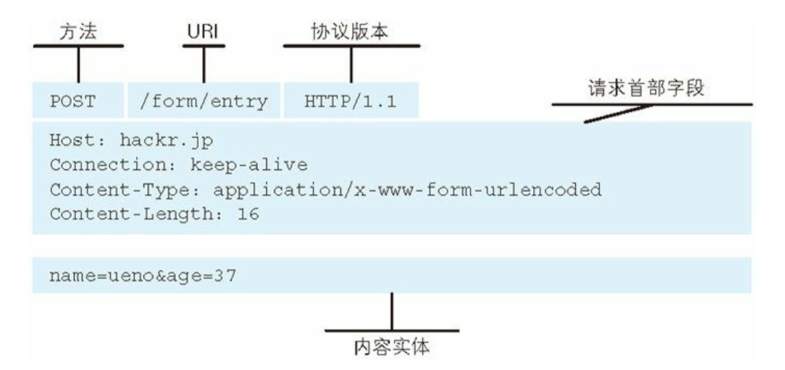
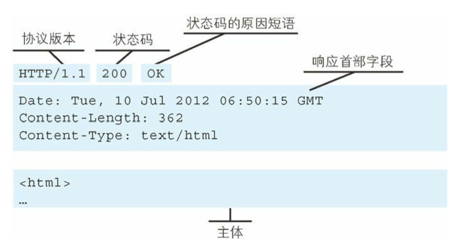
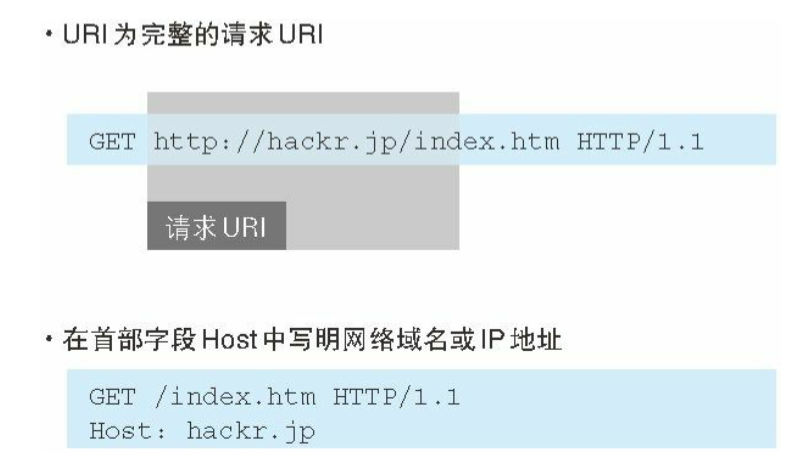
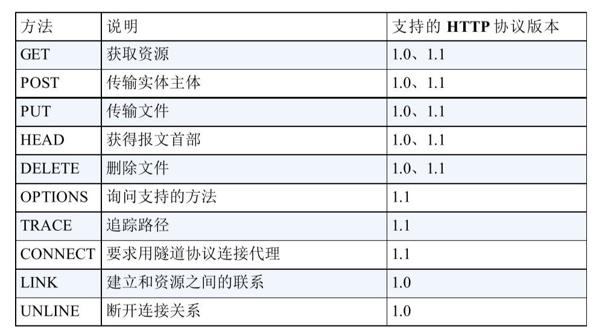

# chapter 2 简单的 HTTP 协议

## HTTP 协议用于客户端和服务器之间的通信

- 请求访问文本或图像等资源的一端称为客户端，而提供资源响应的一端称为服务器端
- 在两台计算机之间使用 HTTP 协议通信时，在一条通信线路上必定有一端是客户端，另一端是服务器端

## 通过请求和响应的交换达成通信

- HTTP 协议规定，请求从客户端发出，最后服务器端响应该请求并返回
- 请求报文是由请求方法、请求 URL、协议版本、可选的请求首部字段和内容实体构成的

- 响应报文基本上由协议版本、状态码（表示请求成功或失败的数字代码）、用以解释状态码的原因短语、可选的响应首部字段以及实体主体构成

## HTTP 是不保存状态的协议

- 即无状态（stateless）协议。HTTP 协议自身不对请求和响应之间的通信状态进行保存，为了更快地处理大量事物，确保协议的可伸缩性

## 请求 URL 定位资源

- 当客户端请求访问资源而发送请求时，URL 将作为请求报文中的请求 URL 包含在内。指定请求 URL 的方式有很多

## 告知服务器意图的 HTTP 方法

> 以下为 HTTP/1.1 中可使用的方法

- GET：获取资源
  - 用来请求访问已被 URL 识别的资源。指定的资源经服务器端解析后返回响应内容
- POST：传输实体主体
- PUT：传输文件
  - 鉴于 HTTP/1.1 的 PUT 方法自身不带验证机制，任何人都可以上传文件，存在安全性问题，因此一般的 Web 网站不使用该方法。若配合 Web 应用程序的验证机制，或架构设计采用 REST（REpresentational State Transfer，表征状态转移）标准的同类 Web 网站，就可能会开放使用 PUT 方法
- HEAD：获得报文首部
- DELETE：删除文件
  - 与 PUT 相反的方法。。。。。
- OPTIONS：询问支持发方法
- TRACE：追踪路径
  - 让 Web 服务器端将之前的请求通信环回给客户端的方法
  - 不常用，易引发 XST（Cross-Site Tracing，跨站追踪）攻击
- CONNECT：要求用隧道协议连接代理
  - 要求在与代理服务器通信时建立隧道，实现用隧道协议进行 TCP 通信
  - 主要使用 SSL（Secure Sockets Layer，安全套接层）和 TLS（Transport Layer Security，传输层安全）协议把通信内容加密后经网络隧道传输

## 使用方法下达命令

- 向请求 URL 指定的资源发送请求报文时，采用称为方法的命令
- 方法可以指定请求的资源按期望产生行为
- HTTP/1.0 和 HTTP/1.1 支持的方法如下（方法名区分大小写，注意要用大写字母）：

## 持久连接

- 请求页面中的资源，每次的请求都会造成无谓的 TCP 连接简历和断开，增加了通信量的开销
- 持久连接（HTTP Persistent Connections，也称为 HTTP keep-alive 或 HTTP connection reuse）
  - 特点：只要任意一端没有明确提出断开连接，则保持 TCP 连接状态
  - 减少了重复连接断开的开销，减轻服务器端的负载；减少开销的时间是请求响应早结束，页面显示快
  - HTTP/1.1 中，所有连接默认都是持久连接
- 管线化
  - 持久连接使得多数请求以管线化（pipelining）方式发送成为可能。不用等待上一个请求响应即可发送下一个请求。并行发送多个请求

## 使用 Cookies 的状态管理

- Cookies 会根据从服务器端发送的响应报文内的 Set-Cookie 的首部字段信息，通知客户端保存 cookie。下次客户端向服务器发送请求时，在请求报文中加入 cookie 值后发送，服务器端接受后，检查对比记录
