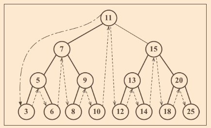
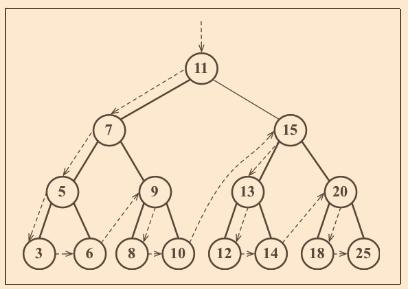
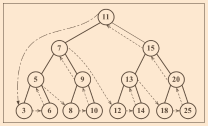
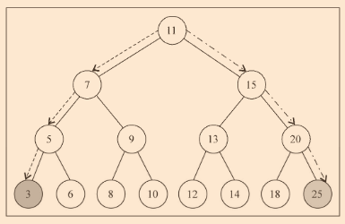
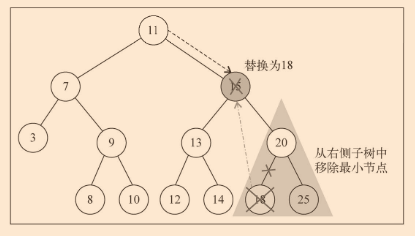

# chapter 8 树

> 非顺序数据结构，对存储需要快送查找的数据非常有用

- 相关术语
- 创建
- 遍历
- 添加和移除
- AVL树

## 相关术语

- 一个树结构包含一系列存在父子关系的节点。每个节点都有一个父节点（除顶部）以及零个或多个子节点
- 位于树顶部的节点叫做根节点
- 节点分为内部节点和外部节点
  - 内部：至少有一个子节点的节点
  - 外部：没有子元素的节点
- 一个节点有祖先和后代
- 子树由节点和它的后代构成
- 节点的深度取决于它的祖先节点的数量
- 树的高度取决于所有节点深度的最大值。层级从0开始

## 二叉树和二叉搜索树

- 二叉树中的节点最多只能有两个子节点：一个是左侧子节点，另一个是右侧子节点
- 二叉搜索树（BST）是二叉树的一种，但它只允许你在左侧节点存储（比父节点）小的值，在右侧节点存储（比父节点）大（或者等于）的值

### 创建BinarySearchTree类（节点称呼为键）

```javascript
function BinarySearchTree() {
  var Node = function(key) {
    this.key = key;
    this.left = null;
    this.right = null;
  };
  var root = null;
}
```

- 向树中插入一个键

```javascript
this.insert = function(key) {
  var newNode = new Node(key);
  if (root === null) {
    root = newNode;
  } else {
    insertNode(root, newNode);
  }
};

var insertNode = function(node, newNode) {
  if (newNode.key < node.key) {
    if (node.left === null) {
      node.left = newNode;
    } else {
      insertNode(node.left, newNode);
    }
  } else {
    if (node.right === null) {
      node.right = newNode;
    } else {
      insertNode(node.right, newNode);
    }
  }
}
```

## 树的遍历

- 访问树的所有节点三种方法：中序、先序和后序

### 中序遍历

- 一种以上行顺序访问BST所有节点的遍历方式，即以从最小到最大的顺序访问所有节点
- 应用：如 对树进行排序操作



```javascript
this.inOrderTraverse = function(callback) {
  inOrderTraverseNode(root, callback);
}
var inOrderTraverseNode = function (node, callback) {
  if (node !== null) {
    inOrderTraverseNode(node.left,callback);
    callback(node.key);
    inOrderTraverseNode(node.right, callback);
  }
}
```

### 先序遍历

- 以优先于后代节点的顺序访问每个节点
- 应用：打印一个结构化的文档



```javascript
this.preOrderTraverse = function(callback) {
  preOrderTraverseNode(root, callback);
}
var preOrderTraverseNode = function (node, callback) {
  if (node !== null) {
    callback(node.key);
    preOrderTraverseNode(node.left, callback);
    preOrderTraverseNode(node.right, callback);
  }
}
```

### 后序遍历

- 先访问节点的后代节点，再访问节点本身
- 应用：计算一个目录和它的子目录中所有文件所占空间的大小



```javascript
this.postOrderTraverse = function(callback) {
  preOrderTraverseNode(root, callback);
}
var postOrderTraverseNode = function (node, callback) {
  if (node !== null) {
    postOrderTraverseNode(node.left, callback);
    postOrderTraverseNode(node.right, callback);
    callback(node.key);
  }
}
```

## 搜索树中的值

- 搜索最小值
- 搜索最大值
- 搜索特定的值

### 搜索最大值和最小值



- 寻找最小/大键

```javascript
this.min = function () {
  return minNode(root);
}
var minNode = function (node) {
  if (node) {
    while (node && node.left !== null) {
      node = node.left;
    }
    return node.key;
  }
  return null;
}

this.max = function () {
  return maxNode(root);
}
var maxNode = function (node) {
  if (node) {
    while (node && node.right !== null) {
      node = node.right;
    }
    return node.key;
  }
  return null;
}
```

### 搜索特定值

```javascript
this.search = function(key) {
  return searchNode(root, key);
}
var searchNode = function(node, key) {
  if (node === null) {
    return false;
  }
  if (key < node.key) {
    return searchNode(node.left, key);
  } else if (key > node.key) {
    return searchNode(node.right, key);
  } else {
    return true;
  }
}
```

- 移除一个节点

```javascript
this.remove = function(key) {
  root = removeNode(root, key);
}
var removeNode = function(node, key) {
  if (node === null) {
    return null;
  }
  if (key < node.key) {
    node.left = removeNode(node.left, key);
    return node;
  } else if (key > node.key) {
    node.right = removeNode(node.right, key);
    return node;
  } else { // 键等于node.key
    if (node.left == null && node.right === null) { // 一个叶节点
      node = null;
      return node;
    }

    // 一个只有一个子节点的节点
    if (node.left === null) {
      node = node.right;
      return node;
    } else if (node.right === null) {
      node = node.left;
      return node;
    }

    // 一个有2个子节点的节点
    var aux = findMinNode(node.right);
    node.key = aux.key;
    node.right = removeNode(node.right, aux.key);
    return node;
  }
}

var findMinNode = function(node) {
  while (node && node.left !== null) {
    node = node.left;
  }
  return node;
}
```

> 移除有两个子节点的节点



## 自平衡树

> BST存在一个问题：取决于你添加的节点数，树的一条边可能会非常深；即树的一条分支会有很多层，而其他的分支却只有几层。这会在需要在某条边上添加、移除和搜索某个节点时引发一些性能问题

### Adelson-Velskii-Landi树（AVL树）

- 一种自平衡树。添加或移除节点时，AVL会尝试自平衡
- 任意一个节点（不论深度）的左子树和右子树高度最低差1
- 添加或移除节点时，AVL树会尽可能尝试转换为完全树

#### 插入节点

- 在AVL树中插入或移除节点与BST基本相同，不同在于AVL需要检验它的平衡因子，如有需要，则将其逻辑应用于树的自平衡

```javascript
var insertNode = function(node, element) {
  if (node === null) {
    node = new Node(element);
  } else if (element < node.key) {
    node.left = insertNode(node.left, element);
    if (node.left !== null) {
      // 确认是否需要平衡
    }
  } else if (element > node.key) {
    node.right = insertNode(node.right, element);
    if (node.right !== null) {
      // 确认是否需要平衡
    }
  }
  return node;
}
```

- 计算平衡因子

```javascript
var heightNode = function(node) {
  if (node === null) {
    return -1;
  } else {
    return Math.max(heightNode(node.left), heightNode(node.right)) + 1;
  }
}
```

#### 完成insertNode方法`?`

### 更多关于二叉树的知识

- 尽管AVL是自平衡的，其插入和移除节点的性能不是最好的。更好的选择是红黑树
