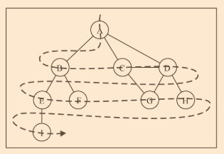
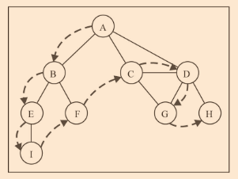

# chapter 9 图

## 相关术语

- 图是网络结构的抽象模型
- 是一组由边连接的节点（或顶点）
- 一个图`G = (V,E)`由以下元素组成
  - V：一组顶点
  - E：一组边，连接 V 中的顶点
- 由一条边连接在一起的顶点称为相邻顶点
- 一个顶点的度是其相邻顶点的数量
- 路径是顶点 v1，v2，...，vk 的一个连续序列
- 其中 v1 和 vi+1 是相邻的
- 简单路径要求不包含重复的顶点

### 有向图和无向图

- 图可以是无向的（边没有方向）或是有向的（有向图）
- 图中没两个顶点间在双向上都存在路径，则改图是强连通的
- 图还可以是未加权的或是加权的

## 图的表示

- 邻接矩阵
  - 每个节点都和一个整数相关联，该整数将作为数组的索引
  - 用一个二维数组来表示顶点之间的连接。如果索引为 i 的节点和索引为 j 的节点相邻，则 array[i][j] === 1，否则 array[i][j] === 0
  - 缺点：不是强连通的图（稀疏图）如果用邻接矩阵来表示，则矩阵中将会有很多 0，浪费了计算机存储空间来表示根本不存在的边。例如，找给定顶点的相邻顶点，即使该顶点只有一个相邻顶点，我们也不得不迭代一整行；图中顶点的数量可能会改变，而 2 维数组不太灵活
- 邻接表（动态数据结构）
  - 由图中每个顶点的相邻顶点列表所组成
- 关联矩阵
  - 矩阵的行表示顶点，列表示边
  - 常用于边的数量比顶点多的情况下，以节省空间和内存

## 创建 Graph 类

- 使用一个数组来存储图中所有顶点的名字，一个字典来存储邻接表，字典会使用顶点的名字作为键，邻接顶点列表作为值。vertices 数组和 adjList 字典都是我们 Graph 类的私有属性

```javascript
function Graph() {
  var vertices = [];
  var adjList = new Dictionary();

  // 向图中添加一个新的顶点
  this.addVertex = function(v) {
    vertices.push(v);
    adjList.set(v, []);
  };

  //  添加顶点之间的边
  this.addEdge = function(v, w) {
    adjList.get(v).push(w);
    adjList.get(w).push(v);
  };
}

// 控制台输出图
this.toString = function() {
  var s = "";
  for (var i = 0; i < vertices.length; i++) {
    s += vertices[i] + " -> ";
    var neighbors = adjList.get(vertices[i]);
    for (var j = 0; j < neighbors.length; j++) {
      s += neighbors[j] + " ";
    }
    s += "\n";
  }
  return s;
};
```

## 图的遍历

- 对图进行遍历的两种算法：广度优先搜索（Breadth-First Search, BFS）和深度优先搜索（Depth-First Search, DFS）
- 图遍历可以用来寻找特定顶点或寻找两个顶点之间的路径，检查图是否联通，检查图是否含有环等
- 图遍历算法的思想：必须追踪每个第一次访问的节点，并且追踪有哪些节点还没有被完全探索。对于两种遍历算法，都需要明确指出第一个被访问的顶点
- 完全探索一个顶点要求查看该顶点的每一条边。对于每一条边所连接的没有被访问过的顶点，将其标注为被发现的，并将其加进待访问顶点列表中
- 为了保证算法的效率，务必访问每个顶点至多两次。连通图中每条边和顶点都会被访问到
- BFS 和 DFS 不同：待访问顶点列表的数据结构

| 算法         | 数据结构 | 描述                                                                 |
| ------------ | -------- | -------------------------------------------------------------------- |
| 深度优先搜索 | 栈       | 通过将顶点存入栈中，顶点是沿着路径被探索的，存在新的相邻顶点就去访问 |
| 广度优先搜索 | 队列     | 通过将顶点存入队列中，最先入队列的顶点先被搜索                       |

- 当要标注已经访问过的顶点时，我们用三种颜色来反映它们的状态
  - 白色：表示该顶点还没有被访问
  - 灰色：表示该顶点被访问过，但并未被探索过
  - 黑色：表示该顶点被访问过且被完全探索过

### 广度优先搜索

- 从指定的第一个顶点开始遍历图，先访问其所有的相邻点，图的一层。先宽后深



- 从顶点 v 开始的广度优先搜索算法步骤
  - 创建一个队列 Q
  - 将 v 标注为被发现的（灰色），并将 v 加入队列 Q
  - 如果 Q 非空，则运行以下步骤：
    - 将 u 从 q 中出队列
    - 将标注 u 为被发现的（灰色）
    - 将 u 所有未被访问过的领点（白色）入队列
    - 将 u 标注为已被探索的（黑色）

```javascript
var initializeColor = function() {
  var color = [];
  for (var i = 0; i < vertices.length; i++) {
    color[vertices[i]] = "white";
  }
  return color;
};

this.bfs = function(v, callback) {
  var color = initializeColor();
  queue = new Queue();
  queue.enqueue(v);
  while (!queue.isEmpty()) {
    var u = queue.dequeue(),
      neighbors = adjList.get(u);
    color[u] = "grey";
    for (var i = 0; i < neighbors.length; i++) {
      var w = neighbors[i];
      if (color[w] === "white") {
        color[w] = "grey";
        queue.enqueue(w);
      }
    }
    color[u] = "black";
    if (callback) {
      callback(u);
    }
  }
};
```

#### 使用 BFS 寻找最短路径

- 给定一个图 G 和源顶点 v，找出对每个顶点 u，u 和 v 之间最短路径的距离（以边的数量计）
- 对于给定顶点 v，广度优先算法会访问所有与其距离为 1 的顶点，接着是距离为 2 的顶点，以此类推。可以使用广度优先算法来解这个问题，修改后的 bfs 方法可以返回给我们一些信息
  - 从 v 到 u 的距离 d[u]
  - 前溯点 pred[u]，用来推导出从 v 到其他每个顶点 u 的最短路径

```javascript
this.BFS = function(v, callback) {
  var color = initializeColor();
  (queue = new Queue()), (d = []), (pred = []);
  queue.enqueue(v);

  for (var i = 0; i < vertices.length; i++) {
    d[vertices[i]] = 0;
    pred[vertices[i]] = null;
  }

  while (!queue.isEmpty()) {
    var u = queue.dequeue(),
      neighbors = adjList.get(u);
    color[u] = "grey";
    for (var i = 0; i < neighbors.length; i++) {
      var w = neighbors[i];
      if (color[w] === "white") {
        color[w] = "grey";
        d[w] = d[u] + 1;
        pred[w] = u;
        queue.enqueue(w);
      }
    }
    color[u] = "black";
  }
  return {
    distance: d,
    predecessors: pred
  };
};

var shortestPathA = graph.BFS(myVertices[0]);
console.log(shortestPathA);
// distances: [A: 0, B: 1, C: 1, D: 1, E: 2, F: 2, G: 2, H: 2 , I: 3],
// predecessors: [A: null, B: "A", C: "A", D: "A", E: "B", F: "B", G: "C", H: "D", I: "E"]

var fromVertex = myVertices[0];
for (var i = 1; i < myVertices.length; i++) {
  var toVertex = myVertices[i],
    path = new Stack();
  for (var v = toVertex; v != fromVertex; v = shortestPathA.predecessors[v]) {
    path.push(v);
  }
  path.push(fromVertex);
  var s = path.pop();
  while (!path.isEmpty()) {
    s += " - " + path.pop();
  }
  console.log(s);
  // A - B
  // A - C
  // A - D
  // A - B - E
  // A - B - F
  // A - C - G
  // A - D - H
  // A - B - E - I
}
```

#### 深入学习最短路径算法

- Dijkstra 算法：解决了单源最短路径
- Bellman-Ford 算法：边权值为负的单源最短路径
- A\*搜索算法：求仅一对顶点间的最短路径问题，用经验法则来加速搜索过程
- Floyd-Warshall 算法：求所有顶点对间的最短路径

### 深度优先搜索

- 从第一个指定的顶点开始遍历图，沿着路径直到这条路径最后一个顶点被访问了，接着原路回退并探索下一条路径



- 该算法不需要一个源顶点。若图中顶点 v 未访问，则访问该顶点 v，要访问顶点 v，步骤如下：
  - 标注 v 为被发现的（灰色）
  - 对于 v 的所有未访问的领点 w，访问顶点 w，标注 v 为已被探索的（黑色）

```javascript
this.dfs = function(callback) {
  var color = initializeColor();
  for (var i = 0; i < vertices.length; i++) {
    if (color[vertices[i]] === "white") {
      dfsVisit(vertices[i], color, callback);
    }
  }
};
var dfsVisit = function(u, color, callback) {
  color[u] = "grey";
  if (callback) {
    callback(u);
  }
  var neighbors = adjList.get(u);
  for (var i = 0; i < neighbors.length; i++) {
    var w = neighbors[i];
    if (color[w] === "white") {
      dfsVisit(w, color, callback);
    }
  }
  color[u] = "black";
  graph.dfs(printNode);
  // Visited vertex: A
  // Visited vertex: B
  // Visited vertex: E
  // Visited vertex: I
  // Visited vertex: F
  // Visited vertex: C
  // Visited vertex: D
  // Visited vertex: G
  // Visited vertex: H
};
```

> ???

#### 探索深度优先算法

#### 拓扑排序————使用深度优先搜索

## 最短路径算法

### Dijikstra 算法

### Floyd—Warshall 算法

## 最小生成树

### Prim 算法

### Kruskal 算法

## 小结
