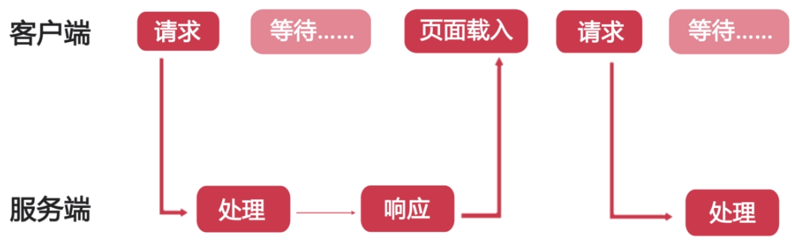
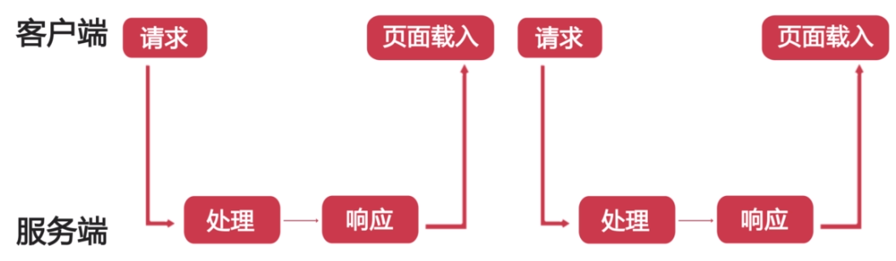

# Ajax全接触

> 慕课网地址：<https://www.imooc.com/learn/250>

## Chapter 1 课程介绍

- Ajax(Asynchronous Javascript and XML)异步的Javascript和XML
  - 一种无需重新加载整个网页的情况之下能够更新部分网页的技术（异步更新、局部更新）

## Chapter 2 概念介绍

### 同步和异步

- 同步(出错只能再次发送请求并等待)



- 异步(把处理数据实时发送到服务端，实时显示返回状态，不用等待。不会阻塞)

  
  - 运用HTML和CSS来实现页面，表达信息
  - 运用XMLHttpRequest和web服务器进行数据的异步交换
  - 根据接受到的数据运用Javascript操作DOM，实现动态局部刷新

### XMLHttpRequest对象的创建

- 实例化XHR对象`var request = new XMLHttpRequest()`

### HTTP请求

- HTTP是计算机通过网络进行通信的规则
  - 浏览器向web服务器请求信息和服务
  - 是一种无状态的协议
    - 不建立持久的连接（服务端不保留连接的相关信息）
- 一个完整的HTTP请求过程，通常7个步骤
  - 建立TCP连接
  - Web浏览器向Web服务器发送请求命令
  - Web浏览器发送请求的头信息
  - Web服务器做出应答
  - Web服务器发送应答头信息
  - Web服务武器向浏览器发送数据
  - Web服务器关闭TCP连接
- 一个HTTP请求一般由四部分组成
  - 请求的方法或动作，比如是GET或是POST请求
  - 正在请求的URL。总得知道请求的地址是什么
  - 请求头，包含一些客户端环境信息，身份验证信息
  - 请求体，也就是请求正文，请求正文中可以包含客户提交的查询字符串信息，表单信息等等。
- GET和POST
  - GET
    - 一般用于信息获取
    - 使用URL传递参数
    - 对所发送信息的数量也有限制，一般在2000个字符
  - POST
    - 一般用于修改服务器上的资源。
    - 对所发送信息的数量无限制
- HTTP响应 一般由三部分组成
  - 一个数字和文字组成的状态码，用来显示请求是成功还是失败
  - 响应头，响应头也和请求头一样包含许多有用的信息，例如服务器类型、日期时间、内容类型和长度等
  - 响应体，也就是响应正文
- HTTP状态码由三位数字构成，其中首位数字定义了状态码的类型
  - 1XX:信息类，表示收到Web浏览器请求，正在进一步的处理中
  - 2XX:成功，表示用户请求被正确接收，理解和处理。例如 200 OK
  - 3XX:重定向，表示请求没有成功，客户必须采取进一步的动作
  - 4XX:客户端错误，表示用户端提交的请求有错误，例如 404 NOT FOUND 意味着请求中所引用的文档不存在
  - 5XX:服务器错误，表示服务器不能完成对请求的处理，如 500
  > 了解状态码的好处：有助于提高Web应用程序调试的效率和准确性

### XMLHttpRequest发送请求

- 一些方法
  - open(method,url,async) async参数指定请求同步/异步,默认异步为true
  - send(string) 把请求发送到服务器 用get string可不填写或none。
  - setRequestHeader写在以上两个方法中间，在post时声明如表单请求样式

### XMLHttpRequest取得响应

- 一些方法
  - responseText:获取字符串形式的响应数据
  - responseXML:获取XML形式的响应数据
  - status和statusText:以数字和文本形式返回HTTP状态码
  - getAllResponseHeader():获取所有的响应报头
- readyState属性：响应返回成功时得到通知
  - 0:请求未初始化，open还没有调用
  - 1:服务器连接已建立，open已经调用了
  - 2:请求已接收，也就是接收到头信息了
  - 3:请求处理中，也就是接收到响应主体了
  - 4:请求已完成，且响应已就绪，也就是响应已完成
  > 通过onreadystatechange事件监听属性值的变化

  ```javascript
  var request = new XMLHttpRequest();
  request.open("GET","get.php",true);
  request.send();
  request.onreadystatechange = function () {
    if (request.readyState === 4 && request.status === 200) {
      // 做一些事 request.responseText
    }
  }
  ```

## Chapter 3 Ajax的简单例子(Ajax + PHP)

### 例子简介

- 功能
  - 查询员工信息，输入编号
  - 新建员工信息，姓名 编号 性别 职位

- 页面
  - 纯html页面。用来实现员工查询和新建
  = php页面，用来查询员工和新建员工的后台接口

- PHP
  - 一种创建动态交互性站点的服务器端脚本语言
  - 能够生成动态页面内容
  - 能够创建、打开、读取、写入、删除以及关闭服务器上的文件
  - 能够接收表单数据
  - 能够发送并取回cookies
  - 能够添加、删除、修改数据库中的数据
  - 限制用户访问网站中的某些页面
  - 对数据进行加密解密
  - ......

- 运行PHP
  - XAMMP（此处本人用的phpstudy）
  - 配置

### 服务器端实现

- 在XAMMP的htdocs中新建ajaxdemo>test.php
- PHP脚本
  - 以`<?php`开头，以`?>`结尾
  - 文件默认扩展名是.php
  - 语句以分号结尾`;`

### PHP服务端代码测试

- 用fiddler进行测试
  - get`http://localhost/ajaxdemo/server.php?number=102`
  - post`http://localhost/ajaxdemo/server.php` 请求主体`name=欧阳锋&number=104&sex=男&job=测试经理`
    - 需要添加`content-Type:application/x-www-form-urlencoded` 填写正确才行

### 客户端实现

- 新建demo.html
- 表单及js设置
- 打开测试`http://localhost/ajaxdemo/demo.html` 浏览器为了安全性考虑，默认禁止本地文件跨域访问。在服务器环境打开
- response preview乱码 设置server.php

`header("Content-Type: application/json;charset=utf-8");`

- POST请求把参数放在send 且要设置setRequestHeader
- 逻辑错误 json数据格式

## Chapter 4 JSON格式

### json的基本概念

- Javascript对象表示法(Javascript Object Notation)
- 是存储和交换文本信息的语法，类似XML。它采用键值对的方式来组织，易于人们阅读和编写，同时也易于机器解析和生成
- 是独立于语言的，也就是说不管什么语言，都可以解析json，只需要按照json的规则来就行
- 与XML相比
  - 长度更短
  - 读写速度更快
  - 可以使用Javascript内建的方法直接进行解析，转换成JavaScript对象，非常方便
- 语法规则
  - 书写格式：名称/值对（键值都要用引号）
  - 值可以是：数字、字符串、逻辑值、数组、对象、null

### json解析、格式化和校验工具

- 在js中解析json两种方式
  - eval 不仅解析了字符串还执行了json字符串中的js方法
  - JSON.parse 遇到方法 报错 不合法
  > 在代码中使用eval是和危险的，特别是执行第三方的json数据（可能包含恶意代码）时，尽可能使用JSON.parse()方法解析字符串本身，该方法还可以捕捉JSON中的语法错误
- 在线json校验工具：<https://jsonlint.com/>
- 利用约定的json数据某个键值，作错误提示等