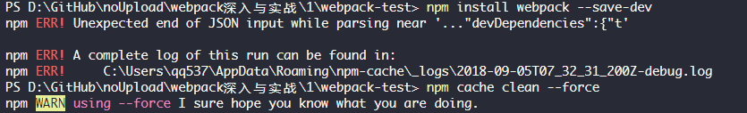

# Chapter 1 start

- `npm init` 
- `npm istall webpack --save-dev`
  - 报错
  
  - 解决
  `npm cache clean --force`

- webpack-test新建hello.js
- 使用官网的方法新建`webpack.config.js`文件建立进出口进行打包 (`webpack hello.js hello.bundle.js` 打包文件 指定文件名 错误。)
- 使用`npm run build`打包.(package.json script加入 "build": "webpack --config webpack.config.js" 打包时报错需要`npm i webpack-cli --save-dev`)
- 新建`world.js`文件，在`hello.js`中引入此文件，再打包
- 新建`style.css`文件，需要`npm i css-loader style-loader --save-dev`.`css-loader`使得webpack能处理css文件，`style-loader`使得webpack把`css-loader`处理完的css文件插入到html中,在`webpack.config.js`中配置loader