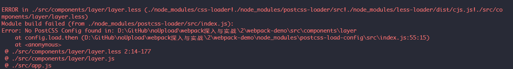

## Chapter 4 

### 4.1-4.3 利用babel-loader处理ES6语言

- 删除src下文件，新建components>layer，layer.html less js
- `npm install --save-dev babel-loader babel-core`
- 配置文件

 ```javascript
 module: {
    rules: [
      { test: /\.js$/, exclude: /node_modules/, loader: "babel-loader" }
    ]
  }
 ```
- `npm install babel-preset-env --save-dev` [官网文档](https://babeljs.io/en/setup#installation)
  - 新建`.babelrc`文件，设置"presets": ["env"]
  - presets也可以在配置文件或package.json中设置 https://www.webpackjs.com/loaders/babel-loader/
  - `npm run build`报错

  

  - [解决方法](http://www.cnblogs.com/soyxiaobi/p/9554565.html)

    - 卸载babel-loader,安装旧版 `npm uninstall babel-loader npm install babel-loader@7.1.5 --save-dev`
  - 注释layer.js中对html的import，不然报错，无法处理此类型文件，再打包
  - 打包速度慢
    - 用exclude使babel-loader打包过的文件不用再次打包

### 4.3 处理CSS

- `npm i style-loader css-loader --save-dev`
- 配置处理css的loader(style-loader在前，不然报错，处理css-loader输出的文件) loader是从右往左处理

   ```javascript
   {
      test: /\.css$/,
      loader: [
        'style-loader',
        'css-loader'
      ]
    }
   ```

- `npm i postcss-loader --save-dev` `npm i autoprefixer --save-dev` 后者是前者的一个插件 [参考文档](https://www.npmjs.com/package/postcss-loader) [插件](https://www.postcss.parts/?searchTerm=)
- 如过css中用import引入其他css，默认不会使用postcss，解决：
  - 设置css-loader时,用以下

     ```javascript
      {
        loader:'css-loader',
        options: { importLoaders: 1 }
      },
     ```

### 4.5 使用less和sass

#### less

- `npm i less-loader --save-dev` 需要安装less依赖 `npm i less --save-dev`
- 配置文件设置less的loader [参考文档](https://www.npmjs.com/package/postcss-loader)
  - postcss-loader放在style-loader和css-loader后，less-loader前 (postcss-loader仍需要设置autofixer的plugin，不然报错如下)
  
  

  - 把需要autofixer的部分（flex需要适配各浏览器）放在其他less文件中，在layer.less用用@import引入，测试autofixer是否仍然有效 有效
  - 使用less-loader时不需要像之前那样给css-loader设置importLoader

#### sass

- `npm i sass-loader --save-dev`
- 配置sass-loader

### 4.6 处理模板文件

- layer.js引入layer.html，app.js中取的模板html中id为app的div，并设置其内容为layer.js中的tpl（layer.html）
- `npm i html-loader --save-dev`
- 配置html-loader匹配规则
- 创建ejs文件 (可以是.ejs或.tpl)
- `npm i ejs-loader --save-dev`
- 配置ejs 
- layer.js引入的html改为tpl
- 在app.js调用时传入所需数据

### 4.7处理图片及其它文件

- layer.less中设置背景图片
- `npm i file-loader --save-dev` 并配置 打包成功
- 在index.html模板文件中用img标签引入图片 打包成功
- 在layer.tpl组件中引用图片  打包成功 但图片不显示
  - 打包后的html中路径为组件中设置的路径，未变成打包后的图片路径
  - 解决1：把相对地址改为绝对地址
  - 解决2：组件的img地址用require形式 `` 打包成功 图片显示
- 设置打包图片输出地址
  - 在配置中设置options [参考文档](https://www.npmjs.com/package/file-loader)
- `npm i url-loader --save-dev` [参考文档](https://www.npmjs.com/package/url-loader)
  - url-loader和file-loader类似，但可以传入一个参数(字节数)作为文件大小限制，超过这个限制，就丢给file-loader处理，未超过，转换为base64编码(会使对应使用图片的文件变大)
  - 在配置里把file-loader改为url-loader 设置limit值为大于图片大小
- 压缩图片`img-webpack-loader`
  - `npm install image-webpack-loader --save-dev` 
  - [配置](https://www.npmjs.com/package/image-webpack-loader) (url-loader的limit设置为小于图片大小）（disable设为false或不设置options值）


## END