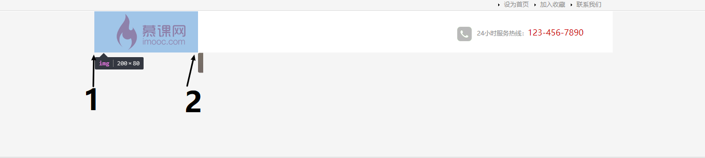

# &lt;img&gt;元素底部为何有空白？

## 问题：

最近听网课遇到这样一个问题，先po出代码如下：

 ```html
 <!--html-->
 <div class="top">
    <div class="top_content">
      <ul>
        <li><a href="#">联系我们</a></li>
        <li><a href="#" onclick="AddFavorite(window.location, document.title)">加入收藏</a></li>
        <li><a href="#" onclick="SetHome(window.location)">设为首页</a></li>
      </ul>
    </div>
  </div>
  <div class="wrap">
    <div class="logo">
      <div class="logo_left"></div>
      <div class="logo_right">24小时服务热线：<span class="tel">123-456-7890</span></div>
    </div>
    <div class="nav">
      <div class="nav_left">
      </div>
    </div>
  </div>
 ```

 ```css
 * {
    margin: 0;
    padding: 0;
    font-size: 12px;
  }

  body {
    background-color: #f5f5f5;
  }

  .top {
    width: 100%;
    height: 27px;
    background: url(../images/top_bg.jpg) repeat-x;
  }

  .top_content {
    width: 1000px;
    margin: 0 auto;
  }

  .top_content li {
    list-style-image: url(../images/li_bg.gif);
    float: right;
    width: 70px;
    line-height: 27px;
  }

  .top_content a:link, .top_content a:visited {
    color: #8e8e8e;
    text-decoration: none;
  }

  .top_content a:hover, .top_content a:active {
    color: #900;
    text-decoration: none;
  }

  .wrap {
    width: 1000px;
    margin: 0 auto;
  }

  .logo {
    height: 80px;
    background-color: #fff;
  }

  .logo_left {
    width: 200px;
    float: left;
  }
  .logo_right {
    width: 300px;
    float: right;
    height: 28px;
    margin-top: 30px;
    color: #8e8e8e;
  }
  .logo_right img {
    vertical-align: middle;
    margin-right: 10px; 
  }
  .tel {
    font-family: "Microsoft YaHei";
    font-size: 16px;
    color: #c00;
  }

  .nav {
    height: 40px;
  }

  .nav_left {
    width: 10px;
    background: url(../images/nav_left.jpg) no-repeat;
    height: 40px;
    float: left;
  }
 ```

显示如下：


.nav_left对应的元素（灰色竖块背景）设置了float left应该和头部左对齐（慕课网logo）。如图：



- 1处应为灰块应该对齐的地方
- 2处为灰块现实对齐的地方
- 为啥会出现这种情况

## 探究：

课程讨论区有人给出解决方案：

[讨论连接](https://www.imooc.com/qadetail/253158)


先试下clear both（在.nav里设置）


似乎对了，我们把对应地方放大和之前显示错误时作对比

- 解决后：
  


- 未解决时：


明显看出利用clear both大体看没问题，但细看灰块所在div与上层div出现了空白。

- 错误显示时小灰块刚好卡在.logo_left在右边。也就是说.logo_left属性的div下部多出一节空白。
- css中.logo属性的div高度设置的的确是80px和.logo_left属性div里面的慕课网logo图片高度是一样的。而.logo_left属性div并未设置高度，会自适应内部图片的占位大小。即logo.jpg所占位置包含了下面多出的空白
- 问题变成img底部空白是怎么来的？

google一下，在某乎发现了[尤雨溪大佬的相关解答](https://www.zhihu.com/question/21558138)。我把解答po在下面：

---

要理解这个问题，首先要弄明白CSS对于 display: inline 元素的 vertical-align 各个值的含义。vertical-align 的默认值是 baseline，这是一个西文排版才有的概念：


可以看到，出现在baseline下面的是 p 啊，q 啊, g 啊这些字母下面的那个尾巴。
对比一下 vertical-align 的另外两个常见值，top 和 bottom:


可以看到，baseline 和 bottom 之间有一定的距离。实际上，inline 的图片下面那一道空白正是 baseline 和 bottom 之间的这段距离。即使只有图片没有文字，只要是 inline 的图片这段空白都会存在。

到这里就比较明显了，要去掉这段空白，最直接的办法是将图片的 vertical-align 设置为其他值。如果在同一行里有文字混排的话，那应该是用 bottom 或是 middle 比较好。

另外，top 和 bottom 之间的值即为 line-height。假如把 line-height 设置为0，那么 baseline 与 bottom 之间的距离也变为0，那道空白也就不见了。如果没有设置 line-height，line-height 的默认值是基于 font-size 的，视渲染引擎有所不同，但一般是乘以一个系数（比如1.2）。因此，在没有设置 line-height 的情况下把 font-size 设为0也可以达到同样的效果。当然，这样做的后果就是不能图文混排了。

作者：尤雨溪
链接：https://www.zhihu.com/question/21558138/answer/18615056
来源：知乎
著作权归作者所有。商业转载请联系作者获得授权，非商业转载请注明出处。

---

## 解决

豁然开朗，inline 的图片下面那一道空白是 baseline 和 bottom 之间的这段距离。去除这段空白，解决方法有以下几种：

- vertical-align 设置为其他值，最直接，同一行里有文字混排的话，用 bottom 或是 middle 比较好（在图片css里设置）
- 把 line-height 设置为0。top 和 bottom 之间的值即为 line-height（在图片父元素.logo_left css里设置）
- 把 font-size 设为0（在没有设置 line-height 的情况下，本文的问题是这种情况）。line-height 的默认值是基于 font-size 的（在图片父元素.logo_left css里设置）

其他的解决办法：

- 图片父元素.logo_left的高度设置为80px
- 图片设置display:block； （非inline元素无基线baseline）

## 总结

- display: inline 元素的vertical-align 的默认值是 baseline
- baseline和容器地步bottom之间有距离，为line-height
- line-height 的默认值基于 font-size ，视渲染引擎有所不同，一般是乘以一个系数（如1.2）


> 相关阅读：[What is Vertical Align?](http://css-tricks.com/what-is-vertical-align/)