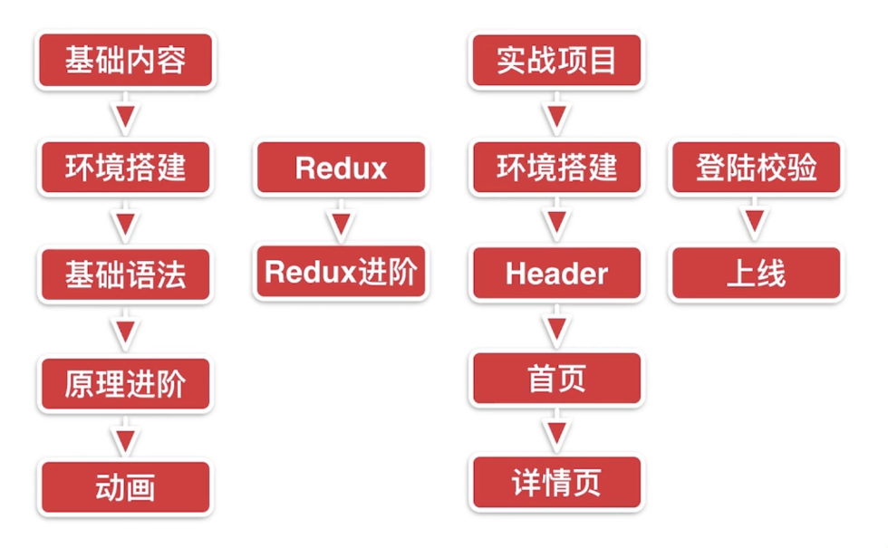
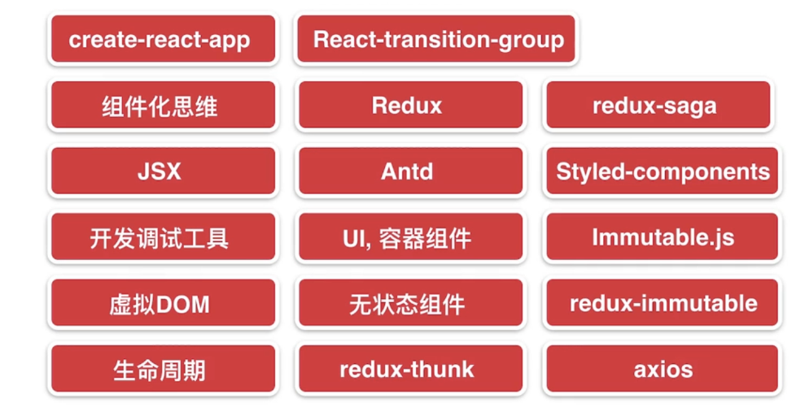
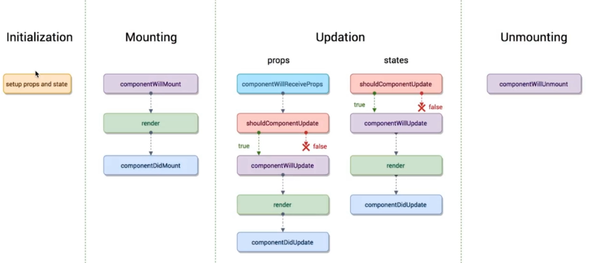

# React简书

## 第一章、导学

### 学习路线



### 技术点



## 第二章、初探React

### 介绍

### 开发环境准备

- 引入.js文件(古老 项目性能低 多次引入)
- 通过脚手架工具来编码 官方脚手架工具 create-react-app
- 脚手架安装
  - 先安依赖node npm
  - `npx create-react-app my-app`

### 项目目录文件简介

- package.json:node包文件
- public
  - index.html 首页模板
  - manifest.json 可以把网页当app存到桌面 再次设置桌面图标 主题色等（可删除）（首页模板引入行也要删除）
- src(项目代码)
  - index.js 项目入口
  - 删除其他不用的文件及代码
  - 关于serviceWorker
    - PWA progressive web application 通过写网页的形式写app
    - 放在https协议的服务器上 第一次需联网 离线后可用
  - App.test.js 自动化测试文件

### React中的组件

- 组件定义 如App.js

  ```javascript
  // 当一个类继承了React Component这个类时 就是一个React组件
  import React, { Component } from 'react';

  class App extends Component {
    render() {
      return (
        <div>
          hello world
        </div>
      );
    }
  }

  export default App;
  // 等价于
  import React from 'react';

  class App extends React.Component {
    render() {
      return (
        <div>
          hello world
        </div>
      );
    }
  }

  export default App;
  ```

- 引入react才能使用jsx语法
- 自定义组件开头大写

## 第三章、React基础

### 编写TodoList功能

- TodoList组件创建及引入
- jsx语法要求一个组件的render函数返回 最外层只能有一个div包裹
  - 如果想不显示最外层div 利用Fragment占位符
- 提交添加功能
  - 数据定义(用constructor)`super(props); // 调用父类构造函数`
  - 绑定事件时需要变更作用域`.bind(this)` 可以把此步放在constructor中作 性能更好
  - 通过`this.setState`更改数据
  - jsx绑定事件，事件名驼峰化
  - 通过扩展运算符向list添加元素后清空iput

    ```javascript
    this.setState({
      list: [...this.state.list, this.state.inputValue],
      inputValue: ''
    })
    ```

  - 循环项需要key值
- 删除功能
  - React不允许直接修改state
  - 创建副本修改副本后 setState给变量

### jsx语法补充

- 代码注释`{/*注释内容*/}`或`{//内容}` 单行注释 注释单独一行与花括号不同行
- 创建style.css文件 并在组件引入
- 定义标签class类时使用`className`
- 如果要设置标签内html内容 给标签绑定`dangerouslySetInnerHTML={{__html: item}}`
- 增加label扩大input点击区域(label的for属性和input id相同)
  - jsx中for会被认为是循环，设置label的for时使用`htmlFor`
- 本节代码如下

```javascript
import React, { Component, Fragment } from 'react';
import './style.css'

class TodoList extends Component {

  constructor(props) {
    super(props);
    this.state = {
      inputValue: '',
      list: []
    }
  }

  render() {
    return (
      <Fragment>
        <div>
          <label htmlFor='insertArea'>输入内容</label>
          <input
            id='insertArea'
            className='input'
            value={this.state.inputValue}
            onChange={this.handleInputChange.bind(this)}
          />
          <button onClick={this.handleBtnClick.bind(this)}>提交</button>
        </div>
        <ul>
          {
            this.state.list.map((item, index) => {
              return (
                <li
                  key={index}
                  onClick={this.handleItemDelete.bind(this, index)}
                  dangerouslySetInnerHTML={{__html: item}}
                >
                </li>
              )
            })
          }
        </ul>
      </Fragment>
    )
  }

  handleInputChange(e) {
    this.setState({
      inputValue: e.target.value
    })
  }

  handleBtnClick() {
    this.setState({
      list: [...this.state.list, this.state.inputValue],
      inputValue: ''
    })
  }

  handleItemDelete(index) {
    const list = [...this.state.list];
    list.splice(index, 1);
    this.setState({
      list: list
    })
  }
}

export default TodoList
```

### 拆分组件与组件之间的传值

- 创建TodoItem组件
- 子组件通过`this.props`获取父组件通过属性传来的值
- 子组件调用父组件方法，父组件通过方法先把方法传给子组件(需要把this指向强制绑定到父组件方法this上)
- 本节代码

```javascript
// TodoList
import React, { Component, Fragment } from 'react';
import './style.css';
import TodoItem from './TodoItem';

class TodoList extends Component {

  constructor(props) {
    super(props);
    this.state = {
      inputValue: '',
      list: []
    }
  }

  render() {
    return (
      <Fragment>
        <div>
          <label htmlFor='insertArea'>输入内容</label>
          <input
            id='insertArea'
            className='input'
            value={this.state.inputValue}
            onChange={this.handleInputChange.bind(this)}
          />
          <button onClick={this.handleBtnClick.bind(this)}>提交</button>
        </div>
        <ul>
          {
            this.state.list.map((item, index) => {
              return (
                <div key={index}>
                  <TodoItem
                    content={item}
                    index={index}
                    deleteItem={this.handleItemDelete.bind(this)}
                  />
                </div>
              )
            })
          }
        </ul>
      </Fragment>
    )
  }

  handleInputChange(e) {
    this.setState({
      inputValue: e.target.value
    })
  }

  handleBtnClick() {
    this.setState({
      list: [...this.state.list, this.state.inputValue],
      inputValue: ''
    })
  }

  handleItemDelete(index) {
    const list = [...this.state.list];
    list.splice(index, 1);
    this.setState({
      list: list
    })
  }
}

export default TodoList

// TodoItem
import React, { Component } from 'react';

class TodoItem extends Component {
  constructor(props) {
    super(props);
    this.handleClick = this.handleClick.bind(this)
  }
  render() {
    return <div onClick={this.handleClick}>{this.props.content}</div>
  }
  handleClick() {
    this.props.deleteItem(this.props.index)
  }
}
export default TodoItem;
```

### 代码优化

- 结构赋值: `const { deleteItem } = this.props` 等价于 `const deleteItem = this.props.deleteItem`
- 样式放在最后引入
- this指向绑定放在上面  constructor
- 循环等代码放在单独函数中返回
- 新版react不推荐在setstate中用对象更改数据 使用函数作返回 此为异步的setState 提高性能 赋的值作进行备份赋值 该函数可以接受参数prevState代替赋值时的this.state

### 衍生思考

- 声明式开发(对应命令式开发-操作dom)
- 可以与其他框架并存
- 组件化
- 单向数据流(子组件只能使用父组件的值 不能更改 更改需调用父组件方法间接调用)
- 视图层框架(只使用react不负责多层组件值传递，只负责数据和页面渲染部分。可以用其他数据层框架)
- 函数式编程
  - 函数拆分，维护容易
  - 自动化测试便捷

## 第四章、React高级内容

### react developertools安装(chrome插件)

### PropTypes与DefaultProps(定义参数默认值)

- PropTypes属性接受强校验
  - import引入`import PropTypes from 'prop-types';`
  - 设置类型：

  ```javascript
    TodoItem.propTypes = {
    content: PropTypes.string,
    deleteItem: PropTypes.func,
    index: PropTypes.number
    }
  ```

  - 未传值不会校验。可以使用`PropTypes.string.isRequired`设为必传
- DefaultProps(未传时默认值)

  ```javascript
    TodoItem.defaultProps = {
      test: 'hello world'
    }
  ```

### Props，State与render函数

- 当组件的state或者props发生改变的时候，render函数就会重新执行
- 当父组件的render函数运行时，它的子组件的render都将被重新运行一次

### React中的虚拟DOM

- 是一个js对象，用它来描述真实DOM
- 减少真实dom创建和对比
- 创建对比虚拟dom(对比js对象耗能少)

### 深入了解虚拟DOM

- 先生成虚拟dom后真实dom
- 优点
  - 性能提升
  - 使得跨端应用得以实现

### 虚拟DOM中的Diff算法

- 同层对比 从顶层开始
- key值

### React中ref的使用(操作DOM)

- 更新数据后操作dom出错 因为setState是异步
- 在setState使用第二个参数(一个函数，会在数据更新后执行)

### React中的生命周期函数

- 在某一个时刻组件会自动调用执行的函数
- 图示




- Mounting(第一次渲染)
  - componentWillMount：在组件即将被挂载到页面的时刻自动执行
  - render：
  - componentDidMount: 组件被挂载到页面之后，自动被执行
- Updating(props或state发生变化时)
  - 如果是props发生变化 会先执行componentWillReceiveProps(当一个组件从父组件接受了参数，只要父组件的render函数被重新执行了，子组件就会执行componentWillReceiveProps，即如果这个组件第一次存在于父组件中，不会执行，如果这个组件已经存在于父组件中才会执行)
  - shouldComponentUpdate：组件被更新之前 自动执行 可以返回true或false 以决定是否更新
  - componentWillUpdate：组件被更新之前 自动执行 在shouldComponentUpdate 返回true后执行
  - render：
  - componentDidUpdate：组件更新完成后 自动执行
- Unmounting
  - componentWillUnmount：当这个组件即将被从页面中剔除的时候，自动执行

### 生命周期函数的使用场景

- shouldComponentUpdate：当父组件更新时即使所包含子组件未发生变化 也会重新被render 使用此方法return false避免未变化子组件的重新渲染 提升性能

  ```javascript
    shouldComponentUpdate(nextProps, nextState) {
      if (nextProps.content !== this.props.content) {
        return true;
      } else {
        return false;
      }
    }
  ```

- componentDidMount: 推荐在此发送ajax请求 安装使用axios发送ajax
- componentWillMount：如果在此发送ajax请求 后续使用redux等高级应用时可能会冲突

### 使用Charles进行接口数据模拟(mock)

### React中实现css过渡动画