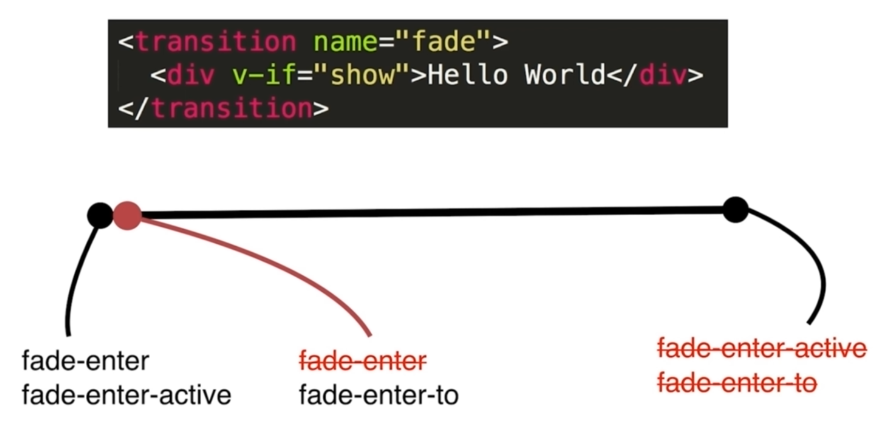
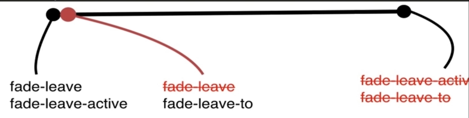

# 动画特效

## Vue中CSS动画原理

- 按钮控制`hello world`显示隐藏(v-if v-show 动态组件都可以) 过程渐隐渐现
  - 把动画部分包裹在`transition`中
  - 动画原理(在不同过程中为内部标签添加不同属性) 不设置name的情况下默认为`v-enter`等 v开头
    - 显示流程

    

    - 隐藏流程

    

## 在Vue中使用Animate.css库

> 以上一节代码为基础

- 可以在transition标签中用属性方式改变class 如`enter-active-class="active"` 就可以在设置style时使用active替代enter-active
- 用`@keyframes`设置动画
- 用animate.css
  - 直接在`transition`标签中使用

   ```html
   <transition
      name="fade"
      enter-active-class="animated swing"
      leave-active-class="animated shake"
    >
        <div v-if="show">hello world</div>
    </transition>
   ```

  - 必须使用自定义class 里面必须包含一个`animated`

## 在Vue中同时使用过渡和动画

> 在上节的代码基础上

- 在`transition`标签中增加 解决打开页面无动画

  ```html
   <transition
      name="fade"
      appear
      enter-active-class="animated swing fade-enter-active"
      leave-active-class="animated shake fade-leave-active"
      appear-active-class="animated swing"
    >
        <div v-if="show">hello world</div>
    </transition>
   ```

- 增加transition动画
- 两种动画时间同步 在`transition`标签中增加`type="transition"` 以style里时间
- 指定动画时间 在`transition`标签中增加`:duration="10000"` 要去掉动画同步
  - 更复杂设置`:duration="{enter: 1000, leave: 5000}"`

## Vue中Js动画与Velocity.js的结合

- 入场
  - `before-enter`钩子事件发生在即将显示之前 有一个参数为显示的dom节点
  - `enter`钩子 在`before-enter`后运行 两个参数 dom结构和回调函数
    - 回调函数在函数结束时执行一下 告诉Vue动画执行完了 回调函数执行完触发`after-enter`
  - `after-enter`
- 出场
  - `before-leave`
  - `leave`
  - `after-leave`
- 下载Velocity.js并引用 删除函数中的自定动画
  - 使用该库后未能重复运行 原因不明

## Vue中多个元素或组件的过渡

- 多个元素过渡动画
  - `transiton`中两个div，toggle按钮更替显示（v-if和else），直接在style标签里设置
    - 为div增加不同key值 Vue不会复用
    - `transiton`标签设置`mode="in-out"` 先进入后隐藏
    - `transiton`标签设置`mode="out-in"` 先隐藏后进入

   ```html
   <!-- 因为Vue对dom复用 动画不会显示 -->
   <style>
    .v-enter, .v-leave-to {
      opacity: 0;
    }
    .v-enter-active, .v-leave-active {
      transition: opacity 1s;
    }
  </style>
   ```

- 多个组件之间的过度（用到动态组件）
  - 新建两个组件 ，放在`transiton`标签中 设置if和else 出现和上一个元素切换一样的效果
  - 用动态组件实现 `<component :is="type"></component>` 删除前两个组件应用 data里设置type默认为child

## Vue中的列表过渡

- 循环显示数组内容，点击按钮新增列表项
- 实现列表过渡
  - 列表项外嵌套`<transition-group>`标签
  - 相当于把每一项都嵌套进`transiton`标签中

## Vue中的动画封装

- 新建一个点击显示隐藏的例子
- 动画封装
  - 新建组件fade

   ```javascript
   //不要使用v-show
   Vue.component('fade', {
      props: ['show'],
      template: `
          <transition>
            <slot v-if="show"></slot>
          </transition>
      `
    })
   ```

  - 在html中使用

   ```html
    <fade :show="show">
        <div>hello world</div>
    </fade>
   ```

- 把css动画改为js动画
  - 删除之前的css
  - 组件修改

   ```javascript
    Vue.component('fade', {
      props: ['show'],
      template: `
          <transition @before-enter="handleBeforeEnter"
          @enter="handleEnter">
            <slot v-if="show"></slot>
          </transition>
      `,
      methods: {
        handleBeforeEnter: function(el) {
          el.style.color = 'red'
        },
        handleEnter: function(el, done) {
          setTimeout(() => {
            el.style.color = 'green';
            done();
          }, 2000);
        }
      }
    })
   ```

> 把动画封装在组件里 推荐

## 小节

- 过渡动画
- keyframes动画
- js实现动画
- 两个动画库（animate.css、velocity.js）
- 多个元素切换动画
- 列表动画
- 其它（动态过渡和状态过渡见官网文档）