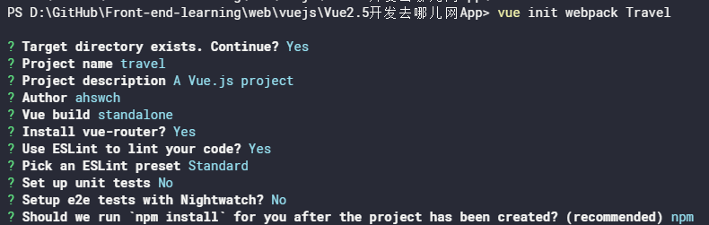
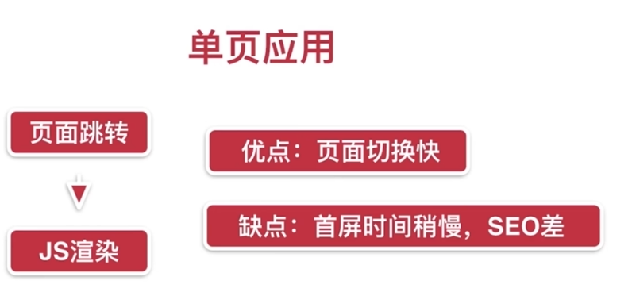

# 项目准备

## 环境准备

- 注册码云
- 新建Travel项目
- 配置公钥
- clone项目至本地(本项目在github托管，以上忽略)
- 安装全局vue脚手架`npm install -g @vue/cli`
- [以旧版2.x安装](https://cli.vuejs.org/zh/guide/creating-a-project.html#%E4%BD%BF%E7%94%A8%E5%9B%BE%E5%BD%A2%E5%8C%96%E7%95%8C%E9%9D%A2)
  - `npm install -g @vue/cli-init`
  - `vue init webpack Travel`
  - 项目名小写
  - 不使用单元测试和端对端测试
  
  
- 进入项目文件夹，`npm run dev`
- 在本地预览：`http://localhost:8080`

## 项目代码结构

- `README.md` 项目说明文件
- `package.json` 依赖包列表文件
- `package-lock.json` 依赖包列表锁文件 确定第三方包的版本 保持团队编程统一
- `index.html` 项目首页模板文件
- `.postcssrc.js` postcss的配置文件
- `gitignore` 不上传git的文件列表
- `.eslintrc.js` 代码检测规范
- `.eslintignore` 不作代码检测的文件列表
- `.editorconfig` 配置编辑器语法
- `.babelrc` 语法解析器babel的配置文件
- `static`文件夹 放置静态资源的地方
- `node_modules`依赖包文件夹
- `src`文件夹 项目代码所在
  - `main.js` 项目入口文件
  - `app.vue` vue根组件
  - `router` 路由放在其index.js中
  - `components` 项目小组件
  - `assets` 项目图片类资源
- `config` 项目配置文件夹
  - `dev.env.js` 开发环境配置
  - `index.js` 基础配置
  - `prod.env.js` 线上环境配置
- `build` 项目打包webpack及其配置文件夹
  - `webpack.base.conf.js` webpack基础配置
  - `webpack.dev.conf.js` webpack开发环境配置
  - `webpack.prod.conf.js` webpack线上环境配置
  - 其它打包过程中的额外配置

## 单文件组件与Vue中的路由

- 入口文件中`components: { App },`为`components: { App: App },`的缩写 有个局部组件名为App，根组件使用局部组件时调用过来也叫App （ES6语法 键值一样写一次）同样的`router,`是`router: router,`的缩写
- 单文件组件——以vue结尾
- 路由：根据网址的不同，返回不同的内容给用户
  - `App.vue`中`<router-view/>`显示的是当前路由地址所对应的内容
- src文件夹删除components，新建pages，里面home》Home.vue
  - 在路由配置文件做相应修改
  - 新建list页面

## 多页应用 VS 单页应用

- 多页
  


> 用router-link进行链接跳转

- Vue用单页应用



> 搜索引擎方面 多页面好 搜索引擎只读去html 不读js 用Vue的一些技术可解决此问题

## 项目代码初始化

- 移动端网页，需要在模板添加viewport的meta标签`<meta name="viewport" content="width=device-width,initial-scale=1.0,minimum-scale=1.0,maxmum-scale=1.0,user-scalable=no">`页面比例始终一比一 无法收缩
- 引入reset.css 初始样式统一 在入口文件中`import './assets/styles/reset.css'`
- 引入border.css(解决多倍屏中1个像素显示2个像素问题)
- 解决在某些移动端浏览器点击延迟300ms问题。引入fastclick库 `npm i fastclick --save` warnig 解决：`npm install --save-dev url-loader@1.0.1`
  - 安装完成后在入口js引入

  ```javascript
  import fastClick from 'fastclick'
  fastClick.attach(document.body) //绑定到body
  ```

- 在iconfont新建项目
- 在路由中删除列表
- 删除pages里列表文件夹
- 清除Home.vue中的代码