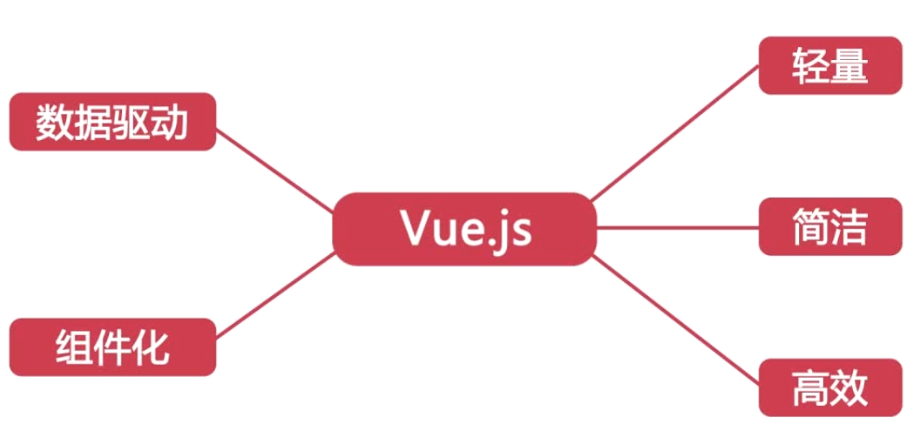
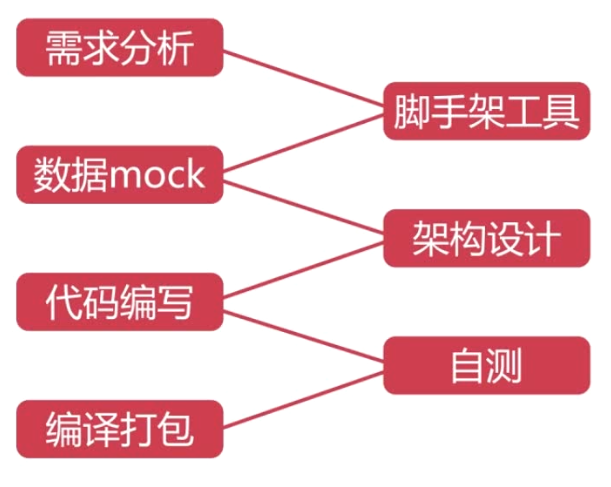

# Chapter 1 介绍

- 使用vuejs开发外卖商家页面
- vuejs

- 过程

- 目标
  - 掌握Vue.js在实战中的运用
  - 使用Vue.js完整地开发移动端App
  - 学会组件化、模块化的开发方式

- 内容
  - Vue.js框架介绍
  - Vue-cli脚手架 搭建基本代码框架
  - vue-router 官方插件管理路由
  - vue-resource Ajax通信
  - Webpack 构建工具
  - es6 + eslint eslint:es6代码风格检查工具
  - 工程化 组件化 模块化
  - 移动端开发技巧
    - flex弹性布局
    - css stickyfooter
    - 酷炫动画
