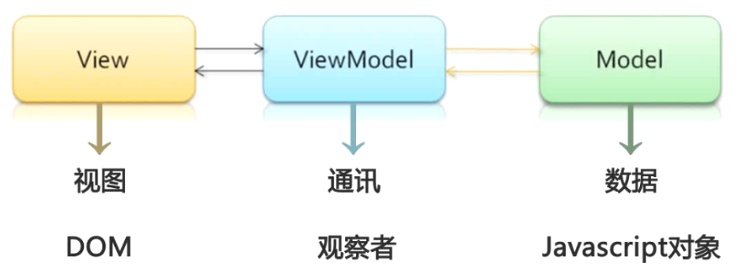
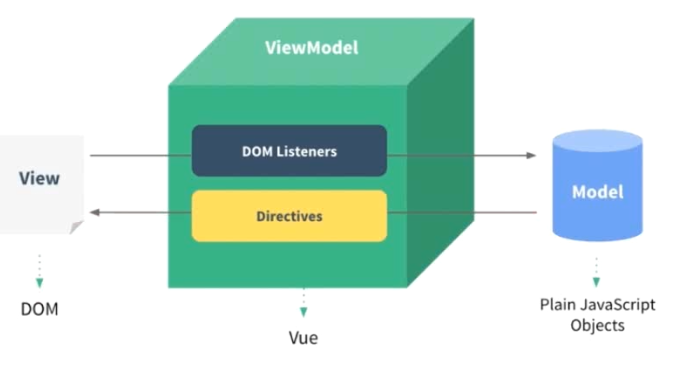
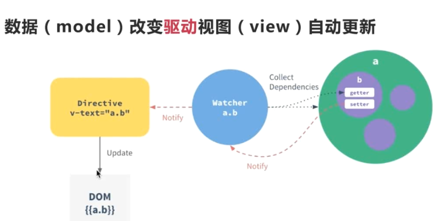

# Chapter 2 Vue.js介绍

- MVVM框架

  

  - 针对具有复杂交互逻辑的前端应用
  - 提供基础的架构抽象
  - 通过Ajax的数据持久化，保证前端用户体验

- vue.js
  - 轻量级MVVM框架
  - 数据驱动+组件化的前端开发
  - 社区完善
  - 对比Angular React
    - 更轻量
    - 易上手，学习曲线平稳
- Vue.js核心思想
  - 数据驱动
    - DOM是数据的一种自然映射

    

    - 数据响应原理

      

  - 组件化
    - 扩展HTML元素，f封装可重用代码
    - 组件设计原则
      - 页面上每个独立的可视/可交互区域视为一个组件
      - 每个组件对应一个工程，目录，组件所需要的各种资源在这个目录下就近维护
      - 页面是组件的容器，组件可以嵌套自由组合形成完整的页面