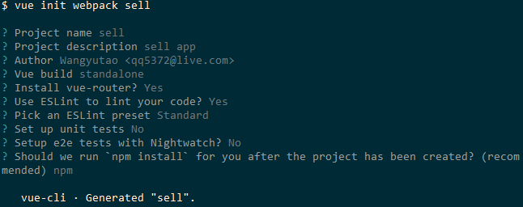

# Chapter 3 Vue-cli 开启Vuejs项目

- vue的脚手架,负责协助编写基础代码
- 按照[官网教程](https://cli.vuejs.org/zh/guide/installation.html)全局安装vue-cli
- 初始化项目`vue init webpack sell`

- 按照命令提示cd到sell并run dev 在本地8080端口查看
- 文件介绍
  - `.babelrc` babel编译配置
  - `.editorconfig` 编辑器配置
  - `.eslintrc.js` eslint配置
  - `index.html`入口页面
  - `src`下的`main.js`页面入口js
