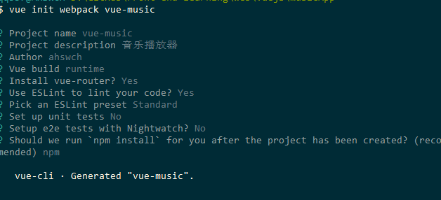

# Chapter 2 准备工作

## 需求分析

- 推荐页面
- 歌手页面
- 排行页面
- 搜索页面
- 音乐播放器
  - 播放器内核
  - 播放列表
  - 用户中心

## Vue-cli脚手架安装

- `vue init webpack vue-music`



- `cd vue-music`
- `npm run dev`
- 预览`http://localhost:8080`

## 项目目录介绍及图标字体、公共样式等资源准备

- src目录树如下

```html
│  App.vue
│  main.js
│
├─api
│      .gitkeep
│
├─common
│  ├─fonts
│  │      music-icon.eot
│  │      music-icon.svg
│  │      music-icon.ttf
│  │      music-icon.woff
│  │
│  ├─image
│  │      default.png
│  │
│  ├─js
│  │      .gitkeep
│  │
│  └─stylus
│          base.styl
│          icon.styl
│          index.styl
│          mixin.styl
│          reset.styl
│          variable.styl
│
├─components
│      .gitkeep
│
├─router
│      index.js
│
└─store
        .gitkeep
```

- 安装stylus依赖`npm i stylus stylus-loader --save-dev`
- 在build里的`webpack.base.conf.js`中设置resolve里的alias: `'styles': resolve('src/assets/styles')` 后面在组件style中直接`@import "~common/stylus/variable"`这样用
- 在common/stylus/variable.styl中定义样式规范
- 在main.js中引入index.styl
- eslint配置部分修改（此处本人未修改，默认配置很满意了）
- 公共样式及图标字体在common下