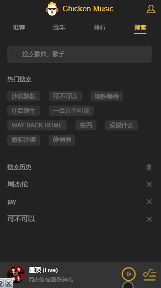

# 移动端音乐音乐app

>慕课网地址<https://coding.imooc.com/class/107.html>

基于全家桶制作的移动端音乐 WebApp ，一个媲美原生的移动端音乐 App，项目完整、功能完备、UI美观、交互一流。

## 预览

- 主要页面


- 播放器


- 其他





## 技术栈

- 前端
  - `Vue`：MVVM 框架
  - `better-scroll`：提升移动端滑动体验
  - `vue-lazyload`：图片懒加载库，优化页面加载速度
  - `vue-router`：页面路由系统
  - `vuex`：Vue 状态管理模式，在多个组件共享数据等

- 后端
  - `Node.js`：本地测试服务器，并代理部分跨域请求
  - `jsonp`：服务端通讯。抓取数据
  - `axios`：服务端通讯。结合 Node.js 代理后端请求，抓取数据

- 其他
  - `vue-cli`：Vue 脚手架工具，快速初始化项目代码
  - `eslint`：代码风格检查工具，规范代码书写

## Build Setup

``` bash
# 下载项目后在musicApp文件夹下打开命令行

# install dependencies
$ npm install

# serve with hot reload at localhost:8080
$ npm run dev

# build for production with minification
$ npm run build
```
