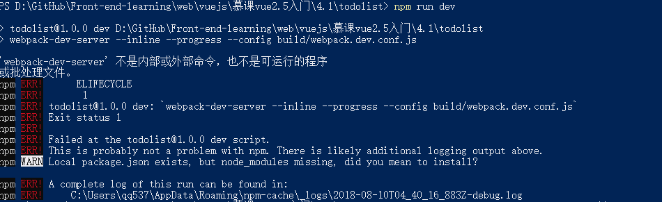
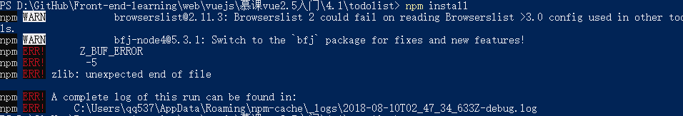
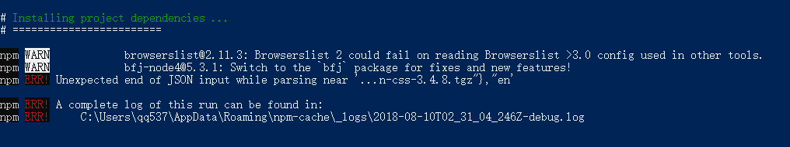

## vue 建立一个新项目并运行（爬坑指南）

#### 下面这是视频所介绍的官网教程

- 全局安装vue-cli

```
npm install --global vue-cli
```

- 创建一个基于webpack模板的新项目

```
vue init webpack projectName 
//router路由n 
//eslint规范代码 y  standard
//unit tests n 自动化测试
//e2e tests n
//use npm

```

- cd到项目文件夹 运行
  
```
npm run dev
```
前两步都没问题 第三步运行npm run dev 报错，如下：


视频中项目文件里应有node_modules文件夹-项目依赖，我建的项目没有这个。在网上查询报错信息找到：
https://blog.csdn.net/lon_01/article/details/79203698 
按照文章中依次运行

```
npm install
npm run build 
npm run dev
```
第一步运行就报错


又在文章中找到一个“新建vue项目”的教程链接
https://segmentfault.com/a/1190000009871504

教程基本过程如下

- 需要的
    - node.js环境（npm包管理器）
    - vue-cli 脚手架构建工具
    - cnpm（npm的淘宝镜像）
- node.js安装
    - 官网下载安装
    - 用node -v 检查，安装成功显示版本号
    - npm集成在node中，可用nmp -v 检测
- 安装cnpm 
    - 输入如下命令后等待安装完成,完成后，可以用cnpm代替npm来安装依赖包了
    ```
    npm install -g cnpm --registry=http://registry.npm.taobao.org
    ```
- 安装vue-cli脚手架构建工具
    - 在命令行中运行命令 cnpm install -g vue-cli ，然后等待安装完成。(注意，这里使用cnpm来替代npm，不然速度超级慢，会导致卡在那)
- 用vue init webpack projectName 新建项目,整个项目需要的依赖资源都还没有安装
- 安装项目所需的依赖
    - cd到项目文件夹，运行命令 cnpm install ，等待安装完成。
    - 安装完成就会出现依赖文件夹node_modules
- 用npm run devy运行项目，即可在本地预览
  
查看之前新建项目的命令日志发现安装依赖时已经报错了


大概是因为更换为国内镜像解决的吧
重新建立一个test项目 直接npm run dev 仍然报错，利用npm install 安装依赖也报错 最后用cnpm install 安装依赖成功，运行成功
